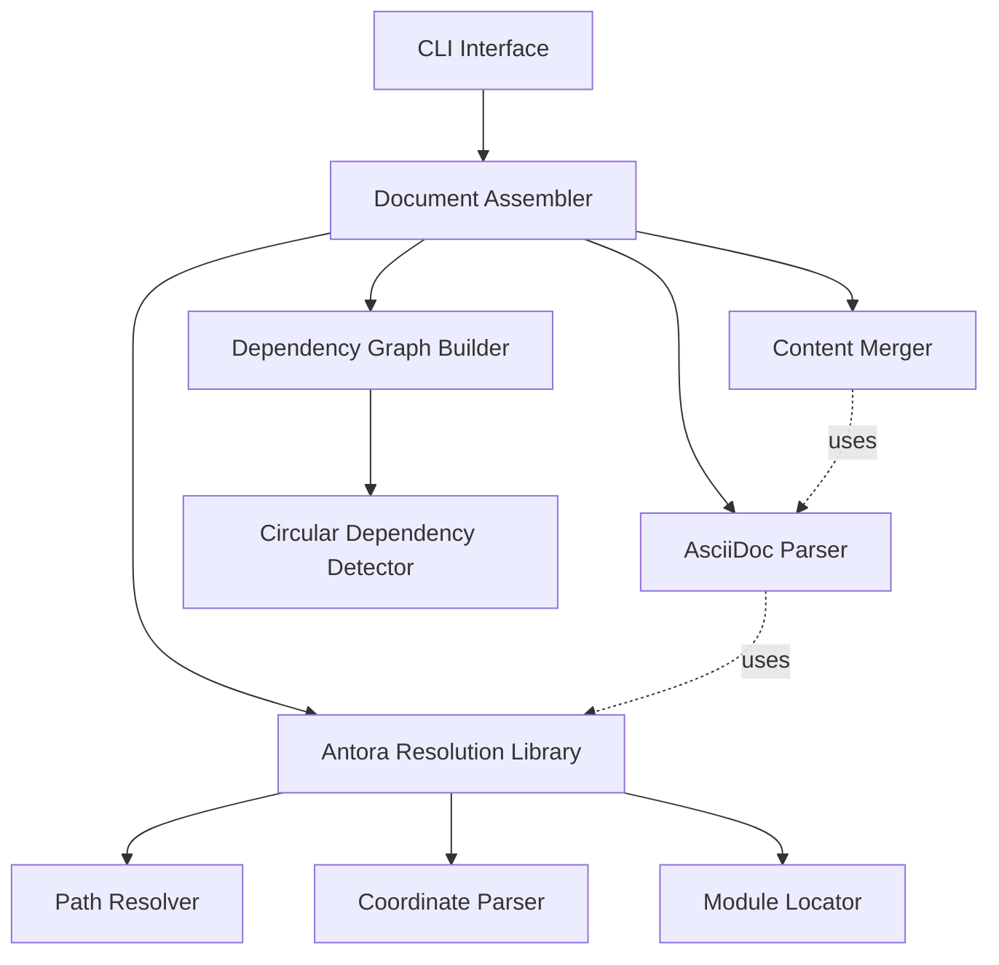

# Design Document: Antora Document Assembler

## Overview

The Antora Document Assembler is a Kotlin Multiplatform tool that consolidates multiple AsciiDoc files organized in an Antora directory structure into a single standalone document. The design consists of two main components:

1. **Antora Resolution Library** (`antora-resolution`): A reusable library that understands Antora directory conventions and resolves resource coordinates to file paths
2. **Document Assembler** (`antora-assembler`): A tool that uses the resolution library to process includes, resolve dependencies, and generate consolidated documents

This modular architecture allows the Antora resolution logic to be reused in other tools such as IDE plugins, documentation validators, or custom processing pipelines.

## Architecture

### Component Diagram



### Module Structure

```
antora-resolution/          # Reusable Antora resolution library
├── src/commonMain/kotlin/
│   └── org/markup/poet/antora/
│       ├── AntoraResolver.kt
│       ├── ResourceCoordinate.kt
│       ├── ResolutionContext.kt
│       └── PathResolver.kt

antora-assembler/           # Document assembler tool
├── src/commonMain/kotlin/
│   └── org/markup/poet/antora/assembler/
│       ├── DocumentAssembler.kt
│       ├── DependencyGraph.kt
│       ├── ContentMerger.kt
│       └── AssemblerConfig.kt
```

## Components and Interfaces

### 1. Antora Resolution Library

#### ResourceCoordinate

Represents an Antora resource reference with its type and path.

```kotlin
package org.markup.poet.antora

/**
 * Represents an Antora resource coordinate.
 * Examples:
 *   - partial$filename.adoc
 *   - example$code.java
 *   - page$other-page.adoc
 *   - image$diagram.png
 *   - module:page$file.adoc (cross-module reference)
 */
data class ResourceCoordinate(
    val type: ResourceType,
    val path: String,
    val module: String? = null,
    val component: String? = null
) {
    companion object {
        /**
         * Parse an Antora coordinate string into a ResourceCoordinate.
         * Returns null if the string is not a valid Antora coordinate.
         */
        fun parse(coordinate: String): ResourceCoordinate?
    }
}

enum class ResourceType {
    PARTIAL,    // partial$
    EXAMPLE,    // example$
    PAGE,       // page$
    IMAGE,      // image$
    ATTACHMENT, // attachment$
    RELATIVE    // No prefix, relative path
}
```

#### ResolutionContext

Provides the context needed to resolve Antora coordinates.

```kotlin
package org.markup.poet.antora

/**
 * Context for resolving Antora resource coordinates.
 * Contains information about the current location and project structure.
 */
data class ResolutionContext(
    val componentRoot: String,
    val currentModule: String = "ROOT",
    val currentComponent: String? = null,
    val currentFilePath: String? = null
) {
    /**
     * Create a new context for a different file within the same module.
     */
    fun withFile(filePath: String): ResolutionContext
    
    /**
     * Create a new context for a different module.
     */
    fun withModule(module: String): ResolutionContext
}
```

#### AntoraResolver

Main interface for the resolution library.

```kotlin
package org.markup.poet.antora

/**
 * Resolves Antora resource coordinates to file system paths.
 * This is the main entry point for the Antora resolution library.
 */
interface AntoraResolver {
    /**
     * Resolve a resource coordinate to an absolute file path.
     * Returns a Result containing either the resolved path or an error.
     */
    fun resolve(
        coordinate: ResourceCoordinate,
        context: ResolutionContext
    ): ResolutionResult
    
    /**
     * Resolve an include directive path (may be coordinate or relative path).
     */
    fun resolveInclude(
        path: String,
        context: ResolutionContext
    ): ResolutionResult
}

sealed class ResolutionResult {
    data class Success(val resolvedPath: String) : ResolutionResult()
    data class Error(val message: String, val errorType: ResolutionErrorType) : ResolutionResult()
}

enum class ResolutionErrorType {
    INVALID_COORDINATE,
    MODULE_NOT_FOUND,
    FILE_NOT_FOUND,
    INVALID_PATH
}
```

#### DefaultAntoraResolver

Implementation of the resolver.

```kotlin
package org.markup.poet.antora

class DefaultAntoraResolver(
    private val fileSystem: FileSystemAccess
) : AntoraResolver {
    
    override fun resolve(
        coordinate: ResourceCoordinate,
        context: ResolutionContext
    ): ResolutionResult {
        // Implementation resolves based on resource type and context
    }
    
    override fun resolveInclude(
        path: String,
        context: ResolutionContext
    ): ResolutionResult {
        // Try parsing as coordinate first, fall back to relative path
    }
    
    private fun resolvePartial(path: String, context: ResolutionContext): String
    private fun resolveExample(path: String, context: ResolutionContext): String
    private fun resolvePage(path: String, context: ResolutionContext): String
    private fun resolveImage(path: String, context: ResolutionContext): String
    private fun resolveRelative(path: String, context: ResolutionContext): String
}
```

#### FileSystemAccess

Platform-agnostic file system interface.

```kotlin
package org.markup.poet.antora

/**
 * Platform-agnostic interface for file system operations.
 * Implementations will use expect/actual for platform-specific code.
 */
interface FileSystemAccess {
    fun exists(path: String): Boolean
    fun isDirectory(path: String): Boolean
    fun readFile(path: String): FileReadResult
    fun listDirectory(path: String): List<String>
}

sealed class FileReadResult {
    data class Success(val content: String) : FileReadResult()
    data class Error(val message: String) : FileReadResult()
}
```

### 2. Document Assembler

#### AssemblerConfig

Configuration for the document assembler.

```kotlin
package org.markup.poet.antora.assembler

data class AssemblerConfig(
    val indexFile: String,
    val outputFile: String,
    val componentRoot: String,
    val maxDepth: Int = 50,
    val preserveComments: Boolean = true,
    val failOnMissingIncludes: Boolean = true,
    val failOnCircularDependencies: Boolean = true
)
```

#### DocumentAssembler

Main assembler interface.

```kotlin
package org.markup.poet.antora.assembler

import org.markup.poet.antora.AntoraResolver
import org.markup.poet.asciidoc.parser.AsciidocParser

/**
 * Assembles multiple AsciiDoc files from an Antora structure into a single document.
 */
interface DocumentAssembler {
    /**
     * Assemble a document from the configured index file.
     * Returns the result containing the assembled document or errors.
     */
    fun assemble(config: AssemblerConfig): AssemblerResult
}

data class AssemblerResult(
    val success: Boolean,
    val outputPath: String?,
    val errors: List<AssemblerError>,
    val warnings: List<AssemblerWarning>,
    val includedFiles: Set<String>
)

data class AssemblerError(
    val message: String,
    val filePath: String?,
    val lineNumber: Int?,
    val errorType: AssemblerErrorType
)

enum class AssemblerErrorType {
    INDEX_FILE_NOT_FOUND,
    PARSE_ERROR,
    INCLUDE_NOT_FOUND,
    CIRCULAR_DEPENDENCY,
    MAX_DEPTH_EXCEEDED,
    FILE_WRITE_ERROR,
    RESOLUTION_ERROR
}

data class AssemblerWarning(
    val message: String,
    val filePath: String?,
    val lineNumber: Int?
)
```

#### DefaultDocumentAssembler

Implementation of the assembler.

```kotlin
package org.markup.poet.antora.assembler

class DefaultDocumentAssembler(
    private val parser: AsciidocParser,
    private val resolver: AntoraResolver,
    private val fileSystem: FileSystemAccess
) : DocumentAssembler {
    
    override fun assemble(config: AssemblerConfig): AssemblerResult {
        val errors = mutableListOf<AssemblerError>()
        val warnings = mutableListOf<AssemblerWarning>()
        val includedFiles = mutableSetOf<String>()
        
        // 1. Read and parse index file
        // 2. Build dependency graph
        // 3. Detect circular dependencies
        // 4. Resolve all includes
        // 5. Merge content
        // 6. Write output
        
        return AssemblerResult(...)
    }
    
    private fun buildDependencyGraph(
        document: Document,
        context: ResolutionContext,
        visited: MutableSet<String>,
        depth: Int,
        config: AssemblerConfig
    ): DependencyGraph
    
    private fun resolveAndMerge(
        document: Document,
        graph: DependencyGraph,
        context: ResolutionContext
    ): Document
}
```

#### DependencyGraph

Tracks file dependencies and detects cycles.

```kotlin
package org.markup.poet.antora.assembler

/**
 * Represents the dependency graph of included files.
 * Tracks which files include which other files.
 */
data class DependencyGraph(
    val nodes: Map<String, DependencyNode>,
    val root: String
) {
    /**
     * Detect circular dependencies in the graph.
     * Returns a list of dependency cycles if any exist.
     */
    fun detectCycles(): List<DependencyCycle>
    
    /**
     * Get all files in topological order (dependencies before dependents).
     */
    fun topologicalSort(): List<String>
}

data class DependencyNode(
    val filePath: String,
    val dependencies: List<String>,
    val sourceLocation: SourceLocation?
)

data class DependencyCycle(
    val files: List<String>
) {
    override fun toString(): String = files.joinToString(" -> ")
}
```

#### ContentMerger

Merges included content into the main document.

```kotlin
package org.markup.poet.antora.assembler

/**
 * Merges included content into a single document.
 * Handles attribute merging, cross-reference resolution, and path updates.
 */
class ContentMerger(
    private val parser: AsciidocParser,
    private val resolver: AntoraResolver
) {
    /**
     * Merge all includes in the document recursively.
     */
    fun merge(
        document: Document,
        graph: DependencyGraph,
        context: ResolutionContext,
        config: AssemblerConfig
    ): MergeResult
    
    private fun processInclude(
        directive: IncludeDirective,
        context: ResolutionContext,
        visited: Set<String>
    ): List<BlockElement>
    
    private fun mergeAttributes(
        base: Map<String, String>,
        included: Map<String, String>
    ): Map<String, String>
    
    private fun updateCrossReferences(
        elements: List<BlockElement>,
        anchorMap: Map<String, String>
    ): List<BlockElement>
    
    private fun updateImagePaths(
        elements: List<BlockElement>,
        sourceContext: ResolutionContext,
        targetContext: ResolutionContext
    ): List<BlockElement>
}

data class MergeResult(
    val document: Document,
    val warnings: List<AssemblerWarning>
)
```

## Data Models

### Antora Directory Structure

The resolver understands this standard Antora structure:

```
docs/
└── modules/
    ├── ROOT/
    │   ├── pages/
    │   │   ├── index.adoc
    │   │   └── getting-started.adoc
    │   ├── partials/
    │   │   └── common-intro.adoc
    │   ├── examples/
    │   │   └── code-sample.java
    │   └── images/
    │       └── diagram.png
    └── admin/
        ├── pages/
        ├── partials/
        ├── examples/
        └── images/
```

### Resolution Rules

1. **partial$filename.adoc** → `modules/{current-module}/partials/filename.adoc`
2. **example$filename.txt** → `modules/{current-module}/examples/filename.txt`
3. **page$filename.adoc** → `modules/{current-module}/pages/filename.adoc`
4. **image$filename.png** → `modules/{current-module}/images/filename.png`
5. **module:page$filename.adoc** → `modules/module/pages/filename.adoc`
6. **./relative.adoc** → Relative to current file's directory
7. **../parent.adoc** → Relative to parent directory

## Error Handling

### Error Categories

1. **Resolution Errors**: Invalid coordinates, missing modules, file not found
2. **Parse Errors**: Invalid AsciiDoc syntax in included files
3. **Dependency Errors**: Circular dependencies, max depth exceeded
4. **I/O Errors**: File read/write failures

### Error Recovery Strategy

- **Continue on non-critical errors**: Collect all errors and warnings, continue processing
- **Fail fast on critical errors**: Stop immediately for index file not found, circular dependencies (if configured)
- **Provide detailed error messages**: Include file path, line number, and context
- **Suggest fixes**: When possible, suggest how to fix the error

## Testing Strategy

### Unit Tests

Unit tests verify specific functionality and edge cases:

- **Coordinate parsing**: Valid and invalid coordinate formats
- **Path resolution**: Different resource types and module references
- **Relative path handling**: Various relative path scenarios
- **Error conditions**: Missing files, invalid coordinates
- **Attribute merging**: Conflict resolution (first wins)
- **Cross-reference resolution**: Anchor preservation and updates
- **Image path updates**: Relative path calculations

### Property-Based Tests

Property-based tests verify universal properties across all inputs. Each property test will run a minimum of 100 iterations.


## Correctness Properties

A property is a characteristic or behavior that should hold true across all valid executions of a system—essentially, a formal statement about what the system should do. Properties serve as the bridge between human-readable specifications and machine-verifiable correctness guarantees.

### Antora Resolution Library Properties

Property 1: Coordinate Resolution Completeness
*For any* valid resource coordinate (partial$, example$, page$, image$) and resolution context, the resolver should return either a successfully resolved path or a specific error type, never crash or return null.
**Validates: Requirements 2.4, 2.5, 3.1**

Property 2: Relative Path Resolution
*For any* relative path without a coordinate prefix and resolution context, the resolver should resolve the path relative to the current file's directory.
**Validates: Requirements 3.6**

Property 3: Module-Qualified Resolution
*For any* module-qualified coordinate (e.g., `module:page$file.adoc`) and resolution context, the resolver should resolve to the specified module's directory structure.
**Validates: Requirements 3.8, 12.1, 12.2**

Property 4: Current Module Default
*For any* unqualified resource coordinate, the resolver should assume the current module from the resolution context.
**Validates: Requirements 12.3**

Property 5: Component-Qualified Resolution
*For any* component-qualified coordinate and resolution context, the resolver should resolve to the target component's directory structure.
**Validates: Requirements 12.5**

### Document Assembler Properties

Property 6: Index File Parsing
*For any* valid AsciiDoc file provided as an index file, the assembler should successfully parse it and treat it as the root of the dependency graph.
**Validates: Requirements 1.1, 1.4**

Property 7: Parse Error Reporting
*For any* invalid AsciiDoc syntax in any file, the assembler should return a descriptive parse error with file path and line number.
**Validates: Requirements 1.3**

Property 8: Attribute Preservation
*For any* document attributes defined in the index file, they should appear in the consolidated document output.
**Validates: Requirements 1.5**

Property 9: Include Resolution and Embedding
*For any* include directive with a resolvable path, the assembler should resolve the path according to Antora conventions and embed the content at the include location.
**Validates: Requirements 4.1, 4.2**

Property 10: Recursive Include Resolution
*For any* included file that contains include directives, the assembler should recursively resolve and embed them up to the maximum depth limit.
**Validates: Requirements 4.3**

Property 11: Line Range Filtering
*For any* include directive with a line range specification, only the specified lines from the included file should appear in the output.
**Validates: Requirements 4.5**

Property 12: Tag Filtering
*For any* include directive with tag specifications, only content within the specified tags should appear in the output.
**Validates: Requirements 4.6**

Property 13: Indentation Preservation
*For any* included content, the indentation level should be preserved relative to the include directive's indentation.
**Validates: Requirements 4.7**

Property 14: Circular Dependency Detection
*For any* dependency graph containing a circular include chain (A includes B, B includes A), the assembler should detect the cycle and report all files in the cycle.
**Validates: Requirements 5.2, 5.3**

Property 15: Error Recovery Continuation
*For any* document with a circular dependency in one branch, the assembler should continue processing other includes and collect all errors.
**Validates: Requirements 5.4**

Property 16: Multiple Cycle Detection
*For any* document with multiple circular dependency cycles, the assembler should detect and report all of them.
**Validates: Requirements 5.5**

Property 17: Cross-Reference Handling
*For any* cross-reference in the document (same-file anchor, cross-file anchor, or Antora xref), the assembler should either preserve it correctly or resolve it to a simple anchor reference while maintaining navigability.
**Validates: Requirements 6.1, 6.2, 6.3**

Property 18: Image Path Resolution
*For any* image reference (Antora coordinate, relative path, or absolute path), the assembler should resolve it correctly and update the path to be relative to the output file location, preserving absolute paths unchanged.
**Validates: Requirements 7.2, 7.3, 7.4**

Property 19: Attribute Merging
*For any* document attributes defined in included files, they should be merged with existing attributes, with the first definition winning in case of conflicts.
**Validates: Requirements 8.2, 8.3**

Property 20: Attribute Reference Preservation
*For any* attribute reference in the document (defined or undefined), the assembler should preserve the reference syntax in the output.
**Validates: Requirements 8.4, 8.5**

Property 21: Content Structure Preservation
*For any* AsciiDoc document with block structures (paragraphs, lists, tables, code blocks), inline formatting (bold, italic, monospace), section headings, block attributes, and comments, all should be preserved in the consolidated output.
**Validates: Requirements 9.1, 9.2, 9.3, 9.4, 9.5**

Property 22: Output Validity (Round-Trip)
*For any* successfully assembled document, the output should be valid AsciiDoc that can be parsed without errors.
**Validates: Requirements 10.4**

Property 23: UTF-8 Encoding Preservation
*For any* input files containing UTF-8 characters (including non-ASCII characters), all characters should be preserved correctly in the output.
**Validates: Requirements 10.5**

Property 24: Error Message Completeness
*For any* error condition (file not found, parse error, circular dependency), the assembler should return an error message indicating the error type and relevant location information.
**Validates: Requirements 11.1**

Property 25: Multiple Error Collection
*For any* document with multiple errors, the assembler should collect and report all errors rather than stopping at the first one.
**Validates: Requirements 11.5**

Property 26: File Reuse Consistency
*For any* file that is included multiple times in the document, the content should be consistent across all inclusions (same parsed result).
**Validates: Requirements 13.3**

Property 27: Depth Limit Enforcement
*For any* include chain exceeding the configured maximum depth, the assembler should stop recursion and return an error indicating excessive nesting.
**Validates: Requirements 13.4**

## Testing Strategy

### Dual Testing Approach

This feature requires both unit tests and property-based tests working together:

- **Unit tests** provide concrete examples and document expected behavior for specific scenarios
- **Property-based tests** verify universal properties across thousands of generated inputs
- Together they provide comprehensive coverage: unit tests catch specific bugs, property tests verify general correctness

### Unit Testing

Unit tests will cover:

**Antora Resolution Library:**
- Coordinate parsing for each type (partial$, example$, page$, image$)
- Path resolution for ROOT module vs named modules
- Relative path resolution with various directory structures
- Error cases: invalid coordinates, missing modules, malformed paths
- Module-qualified and component-qualified resolution
- Edge cases: empty paths, special characters, Windows vs Unix paths

**Document Assembler:**
- Basic assembly with single include
- Nested includes (2-3 levels deep)
- Attribute merging with conflicts
- Cross-reference resolution examples
- Image path updates
- Error handling: missing files, parse errors
- Circular dependency detection (simple A→B→A case)
- Line range and tag filtering examples
- Output file creation and overwriting

### Property-Based Testing

Property-based tests will verify the 27 correctness properties defined above. Each test will run a minimum of 100 iterations with randomly generated inputs.

**Testing Library:** Kotest property testing framework for Kotlin Multiplatform

**Test Organization:**
- `antora-resolution/src/commonTest/kotlin/` - Resolution library property tests
- `antora-assembler/src/commonTest/kotlin/` - Assembler property tests

**Test Tagging:**
Each property test will include a comment tag referencing the design property:
```kotlin
// Feature: antora-document-assembler, Property 1: Coordinate Resolution Completeness
@Test
fun `coordinate resolution should never crash`() = runTest {
    checkAll(Arb.resourceCoordinate(), Arb.resolutionContext()) { coord, ctx ->
        val result = resolver.resolve(coord, ctx)
        result shouldBeInstanceOf<ResolutionResult>()
    }
}
```

**Custom Generators:**
- `Arb.resourceCoordinate()` - Generates valid Antora coordinates
- `Arb.resolutionContext()` - Generates resolution contexts
- `Arb.asciidocDocument()` - Generates valid AsciiDoc documents
- `Arb.includeDirective()` - Generates include directives
- `Arb.circularDependencyGraph()` - Generates graphs with cycles
- `Arb.attributeMap()` - Generates document attributes
- `Arb.utf8String()` - Generates strings with UTF-8 characters

**Property Test Examples:**

```kotlin
// Property 1: Coordinate Resolution Completeness
@Test
fun `all valid coordinates should resolve or return specific error`() = runTest {
    checkAll(
        iterations = 100,
        Arb.resourceCoordinate(),
        Arb.resolutionContext()
    ) { coordinate, context ->
        val result = resolver.resolve(coordinate, context)
        
        when (result) {
            is ResolutionResult.Success -> result.resolvedPath.shouldNotBeEmpty()
            is ResolutionResult.Error -> result.errorType shouldBeIn ResolutionErrorType.values()
        }
    }
}

// Property 14: Circular Dependency Detection
@Test
fun `circular dependencies should be detected and reported`() = runTest {
    checkAll(
        iterations = 100,
        Arb.circularDependencyGraph()
    ) { graph ->
        val cycles = graph.detectCycles()
        
        cycles.shouldNotBeEmpty()
        cycles.forEach { cycle ->
            cycle.files.size shouldBeGreaterThan 1
            // First and last should form a cycle
            cycle.files.first() shouldBe cycle.files.last()
        }
    }
}

// Property 22: Output Validity (Round-Trip)
@Test
fun `assembled output should be valid parseable AsciiDoc`() = runTest {
    checkAll(
        iterations = 100,
        Arb.asciidocDocumentWithIncludes()
    ) { indexFile ->
        val result = assembler.assemble(
            AssemblerConfig(
                indexFile = indexFile.path,
                outputFile = "output.adoc",
                componentRoot = indexFile.componentRoot
            )
        )
        
        if (result.success && result.outputPath != null) {
            val outputContent = fileSystem.readFile(result.outputPath)
            val parseResult = parser.parse(outputContent)
            
            parseResult.errors.filter { it.severity == ErrorSeverity.FATAL }
                .shouldBeEmpty()
        }
    }
}

// Property 23: UTF-8 Encoding Preservation
@Test
fun `UTF-8 characters should be preserved in output`() = runTest {
    checkAll(
        iterations = 100,
        Arb.utf8String(minSize = 10, maxSize = 100)
    ) { utf8Content ->
        val indexFile = createTempFile(utf8Content)
        val result = assembler.assemble(
            AssemblerConfig(
                indexFile = indexFile,
                outputFile = "output.adoc",
                componentRoot = "."
            )
        )
        
        if (result.success && result.outputPath != null) {
            val outputContent = fileSystem.readFile(result.outputPath)
            outputContent shouldContain utf8Content
        }
    }
}
```

### Integration Testing

Integration tests will verify end-to-end scenarios:
- Complete Antora project assembly
- Multi-module documentation assembly
- Large documents with many includes
- Real-world Antora project structures

### Platform-Specific Testing

Since this is a Kotlin Multiplatform project, tests will run on all configured platforms:
- JVM: Full test suite
- Android: Full test suite (host tests)
- iOS: Full test suite
- Linux: Full test suite

File system operations will use expect/actual declarations for platform-specific implementations.

### Test Execution

```bash
# All tests (unit + property-based) across all platforms
./gradlew test

# Specific module tests
./gradlew :antora-resolution:test
./gradlew :antora-assembler:test

# Platform-specific tests
./gradlew :antora-resolution:jvmTest
./gradlew :antora-assembler:iosX64Test
```

### Coverage Goals

- **Unit test coverage**: 80%+ of code paths
- **Property test coverage**: All 27 correctness properties implemented
- **Edge case coverage**: All identified edge cases tested
- **Error path coverage**: All error conditions tested

This comprehensive testing strategy ensures the Antora Document Assembler is robust, correct, and reliable across all platforms and use cases.
