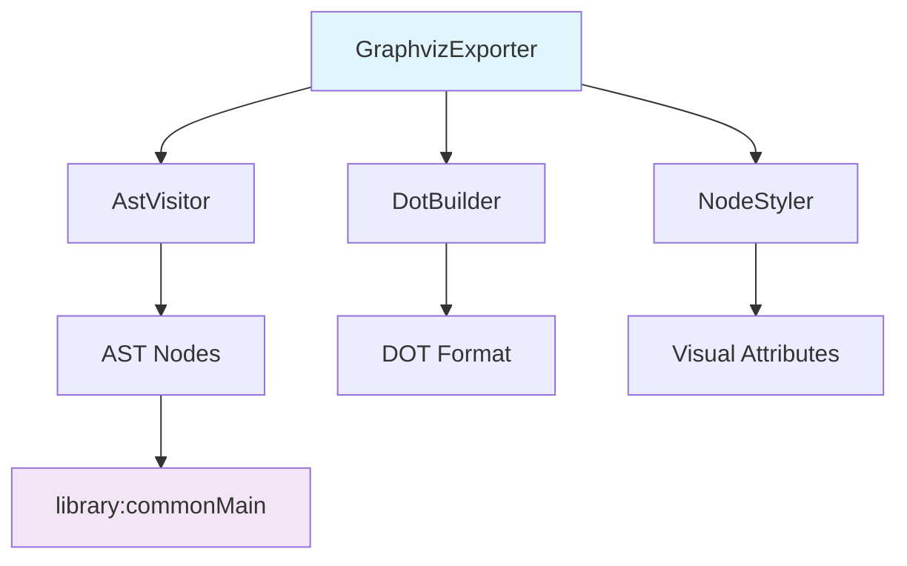

# Design Document: AST to Graphviz Export

## Overview

The AST to Graphviz Export module provides visualization capabilities for AsciiDoc Abstract Syntax Trees by generating DOT format files that can be rendered using Graphviz tools. This standalone module extends the existing AsciiDoc parser library with optional visualization features, allowing developers to understand document structure, debug parsing behavior, and analyze AST transformations.

The module implements a visitor pattern to traverse AST nodes, extracts relevant metadata, and generates properly formatted DOT syntax with visual styling to differentiate node types and relationships.

## Architecture

### Module Structure

The export functionality is organized as a separate Gradle submodule (`ast-graphviz-export`) that depends on the core library module. This separation ensures:

- Optional inclusion of visualization features
- No additional dependencies in the core parser
- Independent versioning and publishing
- Clean separation of concerns

```
ast-graphviz-export/
├── build.gradle.kts
├── src/
│   ├── commonMain/kotlin/
│   │   └── org/markup/poet/asciidoc/export/
│   │       ├── GraphvizExporter.kt
│   │       ├── AstVisitor.kt
│   │       ├── DotBuilder.kt
│   │       └── NodeStyler.kt
│   └── commonTest/kotlin/
│       └── org/markup/poet/asciidoc/export/
│           ├── GraphvizExporterTest.kt
│           ├── AstVisitorTest.kt
│           └── DotBuilderTest.kt
```

### Component Dependencies



## Components and Interfaces

### GraphvizExporter (Main API)

The primary interface for users to export AST to DOT format.

```kotlin
class GraphvizExporter(
    private val config: ExportConfig = ExportConfig.default()
) {
    fun export(document: Document): String
    fun exportToFile(document: Document, filePath: String): Result<Unit>
}

data class ExportConfig(
    val includeAttributes: Boolean = true,
    val includeSourceLocations: Boolean = false,
    val colorScheme: ColorScheme = ColorScheme.DEFAULT,
    val nodeShape: NodeShape = NodeShape.ELLIPSE,
    val orientation: GraphOrientation = GraphOrientation.TOP_DOWN
)
```

### AstVisitor (Traversal Engine)

Implements the visitor pattern to traverse AST nodes and collect visualization data.

```kotlin
interface AstVisitor {
    fun visit(node: AstNode): VisitResult
}

class GraphvizAstVisitor : AstVisitor {
    private val nodeData = mutableListOf<NodeData>()
    private val edges = mutableListOf<EdgeData>()
    
    override fun visit(node: AstNode): VisitResult
    fun getCollectedData(): GraphData
}

data class NodeData(
    val id: String,
    val label: String,
    val nodeType: String,
    val attributes: Map<String, String>,
    val sourceLocation: SourceLocation?
)

data class EdgeData(
    val fromId: String,
    val toId: String,
    val label: String? = null
)
```

### DotBuilder (DOT Format Generation)

Responsible for generating valid DOT syntax from collected AST data.

```kotlin
class DotBuilder(private val config: ExportConfig) {
    fun buildDot(graphData: GraphData): String
    
    private fun generateHeader(): String
    private fun generateNodes(nodes: List<NodeData>): String
    private fun generateEdges(edges: List<EdgeData>): String
    private fun escapeLabel(text: String): String
}
```

### NodeStyler (Visual Styling)

Applies visual styling rules to differentiate AST node types.

```kotlin
class NodeStyler(private val colorScheme: ColorScheme) {
    fun getNodeStyle(nodeType: String): NodeStyle
    fun getEdgeStyle(edgeType: String): EdgeStyle
}

data class NodeStyle(
    val fillColor: String,
    val shape: String,
    val fontColor: String = "black",
    val peripheries: Int = 1
)

enum class ColorScheme {
    DEFAULT, HIGH_CONTRAST, COLORBLIND_FRIENDLY
}
```

## Data Models

### Graph Data Structure

```kotlin
data class GraphData(
    val nodes: List<NodeData>,
    val edges: List<EdgeData>,
    val metadata: GraphMetadata
)

data class GraphMetadata(
    val title: String?,
    val nodeCount: Int,
    val maxDepth: Int,
    val documentAttributes: Map<String, String>
)
```

### Node Identification Strategy

Each AST node receives a unique identifier using a combination of:
- Node type prefix (e.g., "doc_", "sec_", "para_")
- Sequential counter within type
- Optional hash of content for deterministic IDs

```kotlin
class NodeIdGenerator {
    private val counters = mutableMapOf<String, Int>()
    
    fun generateId(node: AstNode): String {
        val prefix = getTypePrefix(node)
        val counter = counters.getOrPut(prefix) { 0 } + 1
        counters[prefix] = counter
        return "${prefix}${counter}"
    }
}
```

## Visual Design Specifications

### Color Scheme Mapping

**Block Elements:**
- Document: `lightblue` with double border
- Section: `lightgreen` with level-based intensity
- Paragraph: `lightyellow`
- Lists: `lightcoral`
- CodeBlock: `lightgray` with monospace font
- Comment: `lightpink` with dashed border

**Inline Elements:**
- Text: `white` (default)
- Strong: `gold` with bold border
- Emphasis: `lavender` with italic font
- Code: `lightgray` with monospace font
- Link: `lightcyan` with underline style
- Image: `lightsteelblue` with image icon

### Node Shape Strategy

- **Block elements**: `box` or `rectangle` shapes
- **Inline elements**: `ellipse` or `oval` shapes  
- **Root document**: `doubleoctagon` for prominence
- **Lists**: `folder` shape for containers

### Layout Optimization

Based on research, AST visualizations can become very wide. The design addresses this through:

1. **Orientation options**: Support both top-down and left-right layouts
2. **Node clustering**: Group related nodes (e.g., list items)
3. **Label truncation**: Limit label length with ellipsis
4. **Hierarchical spacing**: Adjust spacing based on tree depth

## Error Handling

### Input Validation

```kotlin
sealed class ExportError : Exception() {
    object NullDocument : ExportError()
    object EmptyDocument : ExportError()
    data class InvalidConfiguration(val message: String) : ExportError()
    data class FileSystemError(val path: String, val cause: Throwable) : ExportError()
    data class DotGenerationError(val message: String) : ExportError()
}
```

### Recovery Strategies

- **Malformed nodes**: Skip with warning, continue processing
- **Circular references**: Detect and break cycles with special edge styling
- **Missing attributes**: Use default values, log warnings
- **File write failures**: Return detailed error information

## Testing Strategy

### Unit Testing Approach

The module uses a dual testing approach combining traditional unit tests with property-based testing:

**Unit Tests:**
- Test specific examples of AST structures
- Verify DOT format syntax correctness
- Test error handling scenarios
- Validate visual styling rules
- Test file I/O operations

**Property-Based Tests:**
- Verify universal properties across all AST inputs
- Test DOT format validity for any valid AST
- Ensure traversal completeness for all node types
- Validate round-trip consistency where applicable

### Testing Framework Configuration

Using Kotest property-based testing library with minimum 100 iterations per property test. Each property test references its corresponding design document property using the tag format:

**Feature: ast-graphviz-export, Property {number}: {property_text}**

### Test Data Strategy

**Generated Test Data:**
- Random AST structures with varying depths
- Documents with different node type combinations  
- Edge cases: empty documents, single nodes, deeply nested structures
- Invalid inputs for error handling tests

**Fixed Test Cases:**
- Known AsciiDoc documents with expected DOT output
- Regression tests for specific bug scenarios
- Performance benchmarks with large AST structures

## Correctness Properties

*A property is a characteristic or behavior that should hold true across all valid executions of a system-essentially, a formal statement about what the system should do. Properties serve as the bridge between human-readable specifications and machine-verifiable correctness guarantees.*

### Property 1: Complete AST Traversal
*For any* Document node with nested children, the visitor should traverse and collect data from every node in the AST tree, preserving parent-child relationships and extracting node metadata including type, attributes, and source location.
**Validates: Requirements 2.1, 2.2, 2.3, 2.4, 2.5**

### Property 2: Valid DOT Format Generation  
*For any* valid AST structure, the generated DOT output should be syntactically valid according to Graphviz DOT language specification and parseable by standard DOT parsers.
**Validates: Requirements 3.1, 5.2**

### Property 3: Unique Node Identification
*For any* AST structure, every node in the generated DOT output should have a unique identifier, with no duplicate node IDs within the same graph.
**Validates: Requirements 3.2**

### Property 4: Parent-Child Edge Representation
*For any* AST with nested structures, the DOT output should contain directed edges from parent nodes to their direct children, accurately representing the tree structure.
**Validates: Requirements 3.3**

### Property 5: Special Character Escaping
*For any* AST containing nodes with special DOT characters (quotes, backslashes, newlines) in labels or attributes, these characters should be properly escaped in the DOT output.
**Validates: Requirements 3.5**

### Property 6: Visual Node Type Differentiation
*For any* AST containing both block elements and inline elements, the generated DOT output should apply different visual styling (colors, shapes) to distinguish between these node categories.
**Validates: Requirements 4.1, 4.3, 4.5**

### Property 7: Error Handling for Invalid Input
*For any* invalid input (null documents, malformed nodes), the export function should handle the error gracefully and provide clear error messages rather than crashing.
**Validates: Requirements 5.4, 5.5**

### Property 8: File Path Handling
*For any* valid file path provided to the file export function, the system should handle the path correctly, creating parent directories as needed and supporting various path formats.
**Validates: Requirements 6.3, 6.4**