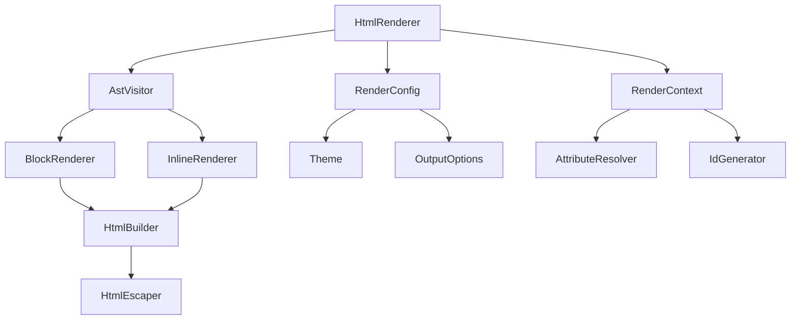
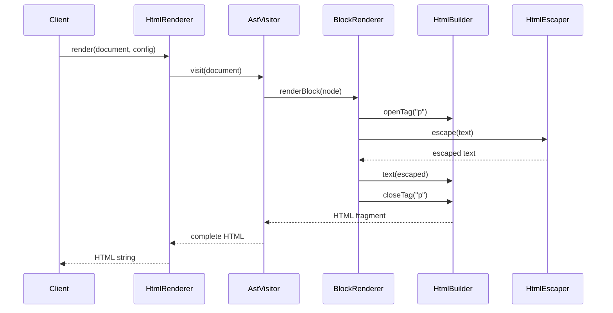

# Design Document: HTML Renderer Module

## Overview

The HTML Renderer module provides a comprehensive solution for converting AsciiDoc Abstract Syntax Trees (AST) into semantic HTML5 output. The design follows a visitor pattern to traverse AST nodes and applies configurable rendering strategies to produce clean, accessible, and secure HTML.

The module is implemented entirely in `commonMain` to ensure cross-platform compatibility across JVM, Android, iOS, and Linux. It integrates seamlessly with the existing asciidoc-parser and document-processing modules, completing the full AsciiDoc processing pipeline.

Key design principles:
- **Separation of concerns**: Distinct components for traversal, rendering, escaping, and configuration
- **Extensibility**: Plugin architecture for custom renderers and themes
- **Security-first**: All content is escaped by default to prevent XSS attacks
- **Semantic HTML**: Prioritize semantic HTML5 elements over presentational markup
- **Accessibility**: WCAG 2.1 Level AA compliance built into default rendering

## Architecture

### Component Diagram



### Core Components

1. **HtmlRenderer**: Main entry point that orchestrates the rendering process
2. **AstVisitor**: Traverses the AST tree and delegates to appropriate renderers
3. **BlockRenderer**: Handles block-level elements (paragraphs, lists, tables, etc.)
4. **InlineRenderer**: Handles inline elements (bold, italic, links, etc.)
5. **HtmlBuilder**: Constructs HTML strings with proper structure and nesting
6. **HtmlEscaper**: Sanitizes text content and attributes to prevent XSS
7. **RenderContext**: Maintains state during rendering (current heading level, ID mappings, etc.)
8. **RenderConfig**: Configuration object for output options and theming
9. **Theme**: Defines CSS classes and styling approach
10. **OutputOptions**: Controls standalone vs fragment mode, CSS inclusion, etc.

### Data Flow



## Components and Interfaces

### HtmlRenderer

Main entry point for rendering AST to HTML.

```kotlin
interface HtmlRenderer {
    /**
     * Renders an AsciiDoc document AST to HTML.
     * 
     * @param document The root document node
     * @param config Rendering configuration
     * @return Result containing HTML string or error
     */
    fun render(document: Document, config: RenderConfig = RenderConfig.default()): Result<String>
}

class DefaultHtmlRenderer(
    private val blockRenderer: BlockRenderer,
    private val inlineRenderer: InlineRenderer,
    private val escaper: HtmlEscaper = DefaultHtmlEscaper()
) : HtmlRenderer {
    override fun render(document: Document, config: RenderConfig): Result<String> {
        val context = RenderContext(config)
        val visitor = AstVisitor(blockRenderer, inlineRenderer, context)
        
        return try {
            val bodyHtml = visitor.visit(document)
            val html = if (config.outputOptions.standalone) {
                wrapInDocument(bodyHtml, document, config)
            } else {
                bodyHtml
            }
            Result.success(html)
        } catch (e: RenderException) {
            Result.failure(e)
        }
    }
    
    private fun wrapInDocument(body: String, document: Document, config: RenderConfig): String {
        // Generate complete HTML document with head and body
    }
}
```

### AstVisitor

Traverses the AST and delegates rendering to appropriate handlers.

```kotlin
class AstVisitor(
    private val blockRenderer: BlockRenderer,
    private val inlineRenderer: InlineRenderer,
    private val context: RenderContext
) {
    fun visit(node: AstNode): String {
        return when (node) {
            is Document -> visitDocument(node)
            is BlockElement -> blockRenderer.render(node, context)
            is InlineElement -> inlineRenderer.render(node, context)
            else -> {
                context.logWarning("Unknown node type: ${node::class.simpleName}")
                ""
            }
        }
    }
    
    private fun visitDocument(document: Document): String {
        return document.blocks.joinToString("\n") { visit(it) }
    }
}
```

### BlockRenderer

Renders block-level elements to HTML.

```kotlin
interface BlockRenderer {
    fun render(block: BlockElement, context: RenderContext): String
}

class DefaultBlockRenderer(
    private val builder: HtmlBuilder,
    private val inlineRenderer: InlineRenderer
) : BlockRenderer {
    override fun render(block: BlockElement, context: RenderContext): String {
        return when (block) {
            is Heading -> renderHeading(block, context)
            is Paragraph -> renderParagraph(block, context)
            is UnorderedList -> renderUnorderedList(block, context)
            is OrderedList -> renderOrderedList(block, context)
            is CodeBlock -> renderCodeBlock(block, context)
            is Table -> renderTable(block, context)
            is Quote -> renderQuote(block, context)
            is ImageBlock -> renderImageBlock(block, context)
            else -> renderUnknownBlock(block, context)
        }
    }
    
    private fun renderHeading(heading: Heading, context: RenderContext): String {
        val level = heading.level.coerceIn(1, 6)
        val id = context.generateId(heading.text)
        val classes = context.theme.headingClasses(level)
        
        return builder.build {
            openTag("h$level", mapOf("id" to id, "class" to classes))
            text(renderInlineContent(heading.content, context))
            closeTag("h$level")
        }
    }
    
    private fun renderParagraph(paragraph: Paragraph, context: RenderContext): String {
        val classes = context.theme.paragraphClasses()
        
        return builder.build {
            openTag("p", mapOf("class" to classes))
            text(renderInlineContent(paragraph.content, context))
            closeTag("p")
        }
    }
    
    private fun renderCodeBlock(code: CodeBlock, context: RenderContext): String {
        val language = code.language ?: ""
        val languageClass = if (language.isNotEmpty()) "language-$language" else ""
        val classes = context.theme.codeBlockClasses()
        
        return builder.build {
            openTag("pre", mapOf("class" to classes))
            openTag("code", mapOf("class" to languageClass))
            text(builder.escape(code.content))
            closeTag("code")
            closeTag("pre")
        }
    }
    
    private fun renderTable(table: Table, context: RenderContext): String {
        val classes = context.theme.tableClasses()
        
        return builder.build {
            openTag("table", mapOf("class" to classes))
            if (table.hasHeader) {
                openTag("thead")
                renderTableRow(table.header, isHeader = true, context)
                closeTag("thead")
            }
            openTag("tbody")
            table.rows.forEach { row ->
                renderTableRow(row, isHeader = false, context)
            }
            closeTag("tbody")
            closeTag("table")
        }
    }
    
    private fun renderInlineContent(content: List<InlineElement>, context: RenderContext): String {
        return content.joinToString("") { inlineRenderer.render(it, context) }
    }
}
```

### InlineRenderer

Renders inline elements to HTML.

```kotlin
interface InlineRenderer {
    fun render(inline: InlineElement, context: RenderContext): String
}

class DefaultInlineRenderer(
    private val builder: HtmlBuilder
) : InlineRenderer {
    override fun render(inline: InlineElement, context: RenderContext): String {
        return when (inline) {
            is Text -> builder.escape(inline.content)
            is Bold -> renderBold(inline, context)
            is Italic -> renderItalic(inline, context)
            is Code -> renderCode(inline, context)
            is Link -> renderLink(inline, context)
            is InlineImage -> renderInlineImage(inline, context)
            is Subscript -> renderSubscript(inline, context)
            is Superscript -> renderSuperscript(inline, context)
            else -> renderUnknownInline(inline, context)
        }
    }
    
    private fun renderBold(bold: Bold, context: RenderContext): String {
        return builder.build {
            openTag("strong")
            text(renderNestedInline(bold.content, context))
            closeTag("strong")
        }
    }
    
    private fun renderLink(link: Link, context: RenderContext): String {
        val sanitizedUrl = sanitizeUrl(link.url)
        val attrs = mutableMapOf("href" to sanitizedUrl)
        
        if (link.title != null) {
            attrs["title"] = builder.escapeAttribute(link.title)
        }
        
        return builder.build {
            openTag("a", attrs)
            text(renderNestedInline(link.content, context))
            closeTag("a")
        }
    }
    
    private fun sanitizeUrl(url: String): String {
        // Prevent javascript: and data: URI schemes
        val lower = url.trim().lowercase()
        if (lower.startsWith("javascript:") || lower.startsWith("data:")) {
            return "#"
        }
        return url
    }
    
    private fun renderNestedInline(content: List<InlineElement>, context: RenderContext): String {
        return content.joinToString("") { render(it, context) }
    }
}
```

### HtmlBuilder

Constructs HTML strings with proper structure.

```kotlin
interface HtmlBuilder {
    fun build(block: HtmlBuilder.() -> Unit): String
    fun openTag(name: String, attributes: Map<String, String> = emptyMap())
    fun closeTag(name: String)
    fun text(content: String)
    fun escape(text: String): String
    fun escapeAttribute(text: String): String
}

class DefaultHtmlBuilder(
    private val escaper: HtmlEscaper
) : HtmlBuilder {
    private val buffer = StringBuilder()
    
    override fun build(block: HtmlBuilder.() -> Unit): String {
        buffer.clear()
        block()
        return buffer.toString()
    }
    
    override fun openTag(name: String, attributes: Map<String, String>) {
        buffer.append("<").append(name)
        attributes.forEach { (key, value) ->
            if (value.isNotEmpty()) {
                buffer.append(" ").append(key).append("=\"")
                buffer.append(escapeAttribute(value))
                buffer.append("\"")
            }
        }
        buffer.append(">")
    }
    
    override fun closeTag(name: String) {
        buffer.append("</").append(name).append(">")
    }
    
    override fun text(content: String) {
        buffer.append(content)
    }
    
    override fun escape(text: String): String {
        return escaper.escapeHtml(text)
    }
    
    override fun escapeAttribute(text: String): String {
        return escaper.escapeAttribute(text)
    }
}
```

### HtmlEscaper

Sanitizes content to prevent XSS attacks.

```kotlin
interface HtmlEscaper {
    fun escapeHtml(text: String): String
    fun escapeAttribute(text: String): String
}

class DefaultHtmlEscaper : HtmlEscaper {
    override fun escapeHtml(text: String): String {
        return text
            .replace("&", "&amp;")
            .replace("<", "&lt;")
            .replace(">", "&gt;")
    }
    
    override fun escapeAttribute(text: String): String {
        return text
            .replace("&", "&amp;")
            .replace("<", "&lt;")
            .replace(">", "&gt;")
            .replace("\"", "&quot;")
            .replace("'", "&#39;")
    }
}
```

### RenderContext

Maintains state during rendering.

```kotlin
class RenderContext(
    val config: RenderConfig
) {
    val theme: Theme = config.theme
    private val idMap = mutableMapOf<String, Int>()
    private val warnings = mutableListOf<String>()
    
    fun generateId(text: String): String {
        val base = text
            .lowercase()
            .replace(Regex("[^a-z0-9]+"), "-")
            .trim('-')
        
        val count = idMap.getOrDefault(base, 0)
        idMap[base] = count + 1
        
        return if (count == 0) base else "$base-$count"
    }
    
    fun logWarning(message: String) {
        warnings.add(message)
    }
    
    fun getWarnings(): List<String> = warnings.toList()
}
```

### RenderConfig

Configuration for rendering behavior.

```kotlin
data class RenderConfig(
    val outputOptions: OutputOptions = OutputOptions.default(),
    val theme: Theme = Theme.default(),
    val customRenderers: Map<String, CustomRenderer> = emptyMap(),
    val attributeHandlers: Map<String, AttributeHandler> = emptyMap()
) {
    companion object {
        fun default() = RenderConfig()
    }
}

data class OutputOptions(
    val standalone: Boolean = true,
    val cssMode: CssMode = CssMode.INLINE,
    val cssPath: String? = null,
    val includeMetadata: Boolean = true,
    val documentTitle: String? = null,
    val language: String = "en",
    val customAttributes: Map<String, String> = emptyMap()
) {
    companion object {
        fun default() = OutputOptions()
    }
}

enum class CssMode {
    NONE,      // No CSS
    INLINE,    // CSS in <style> tag
    EXTERNAL   // CSS via <link> tag
}
```

### Theme

Defines CSS classes for elements.

```kotlin
interface Theme {
    fun headingClasses(level: Int): String
    fun paragraphClasses(): String
    fun codeBlockClasses(): String
    fun tableClasses(): String
    fun listClasses(): String
    fun quoteClasses(): String
    fun admonitionClasses(type: String): String
    
    fun getCss(): String
    
    companion object {
        fun default(): Theme = DefaultTheme()
    }
}

class DefaultTheme : Theme {
    override fun headingClasses(level: Int) = "heading heading-$level"
    override fun paragraphClasses() = "paragraph"
    override fun codeBlockClasses() = "code-block"
    override fun tableClasses() = "table"
    override fun listClasses() = "list"
    override fun quoteClasses() = "quote"
    override fun admonitionClasses(type: String) = "admonition admonition-$type"
    
    override fun getCss(): String {
        return """
            .heading { margin: 1em 0 0.5em; font-weight: bold; }
            .heading-1 { font-size: 2em; }
            .heading-2 { font-size: 1.5em; }
            .heading-3 { font-size: 1.25em; }
            .paragraph { margin: 0.5em 0; }
            .code-block { background: #f5f5f5; padding: 1em; overflow-x: auto; }
            .table { border-collapse: collapse; width: 100%; }
            .table th, .table td { border: 1px solid #ddd; padding: 0.5em; }
            .quote { border-left: 4px solid #ddd; padding-left: 1em; margin: 1em 0; }
        """.trimIndent()
    }
}
```

## Data Models

### AST Node Types (from asciidoc-parser)

The renderer works with AST nodes defined in the asciidoc-parser module:

**Block Elements:**
- `Document`: Root node containing metadata and blocks
- `Heading`: Heading with level (1-6) and content
- `Paragraph`: Text paragraph with inline content
- `UnorderedList`: Bulleted list with items
- `OrderedList`: Numbered list with items
- `CodeBlock`: Code listing with optional language
- `Table`: Tabular data with headers and rows
- `Quote`: Block quotation with optional attribution
- `ImageBlock`: Block-level image with caption

**Inline Elements:**
- `Text`: Plain text content
- `Bold`: Strong emphasis
- `Italic`: Emphasis
- `Code`: Inline code
- `Link`: Hyperlink with URL and content
- `InlineImage`: Inline image
- `Subscript`: Subscript text
- `Superscript`: Superscript text

### Render Result

```kotlin
sealed class RenderResult {
    data class Success(val html: String, val warnings: List<String> = emptyList()) : RenderResult()
    data class Failure(val error: RenderException) : RenderResult()
}

sealed class RenderException(message: String) : Exception(message) {
    data class InvalidAst(val node: AstNode, val reason: String) : 
        RenderException("Invalid AST structure at ${node::class.simpleName}: $reason")
    
    data class InvalidConfiguration(val setting: String, val reason: String) : 
        RenderException("Invalid configuration for $setting: $reason")
    
    data class ValidationFailure(val html: String, val errors: List<String>) : 
        RenderException("Generated HTML failed validation: ${errors.joinToString(", ")}")
}
```

## Correctness Properties

*A property is a characteristic or behavior that should hold true across all valid executions of a system—essentially, a formal statement about what the system should do. Properties serve as the bridge between human-readable specifications and machine-verifiable correctness guarantees.*


### Property 1: Document Structure Completeness

*For any* Document AST node rendered in standalone mode, the output HTML SHALL contain `<html>`, `<head>`, and `<body>` elements with proper nesting.

**Validates: Requirements 1.1, 5.1**

### Property 2: Block Element Semantic Mapping

*For any* BlockElement node, the renderer SHALL produce the semantically correct HTML5 block element: Heading → `<h1>`-`<h6>`, Paragraph → `<p>`, UnorderedList → `<ul>`, OrderedList → `<ol>`, CodeBlock → `<pre><code>`, Table → `<table>`, Quote → `<blockquote>`, ImageBlock → `<figure>`.

**Validates: Requirements 1.2, 2.1, 2.2, 2.3, 2.4, 2.5, 2.6, 2.7, 2.8**

### Property 3: Inline Element Semantic Mapping

*For any* InlineElement node, the renderer SHALL produce the semantically correct HTML5 inline element: Bold → `<strong>`, Italic → `<em>`, Code → `<code>`, Link → `<a>`, InlineImage → ``, Subscript → `<sub>`, Superscript → `<sup>`.

**Validates: Requirements 1.3, 3.1, 3.2, 3.3, 3.4, 3.5, 3.6, 3.7**

### Property 4: HTML Nesting Preservation

*For any* AST with nested nodes (block or inline), the generated HTML SHALL maintain proper tag nesting where every opening tag has a corresponding closing tag in the correct order, and no tags are improperly interleaved.

**Validates: Requirements 1.4, 3.8**

### Property 5: HTML Escaping Completeness

*For any* text content, the escaper SHALL convert all special HTML characters: `&` → `&amp;`, `<` → `&lt;`, `>` → `&gt;`, and in attributes additionally `"` → `&quot;` and `'` → `&#39;`.

**Validates: Requirements 4.1, 4.2, 4.3, 4.4, 4.5, 4.7**

### Property 6: URL Sanitization

*For any* URL in a Link or InlineImage node, if the URL starts with `javascript:` or `data:` (case-insensitive), the renderer SHALL replace it with `#` to prevent XSS attacks.

**Validates: Requirements 4.6**

### Property 7: Fragment Mode Exclusion

*For any* Document AST node rendered in fragment mode, the output HTML SHALL NOT contain `<html>`, `<head>`, or `<body>` elements.

**Validates: Requirements 5.2**

### Property 8: CSS Mode Correspondence

*For any* Document rendered with CSS configuration, the output SHALL contain: a `<style>` tag when CssMode is INLINE, a `<link>` tag when CssMode is EXTERNAL, and neither when CssMode is NONE.

**Validates: Requirements 5.3, 5.4, 5.5**

### Property 9: Custom Attributes Application

*For any* custom HTML attributes provided in configuration, they SHALL appear in the root element's attribute list in the generated HTML.

**Validates: Requirements 5.6**

### Property 10: Title Tag Inclusion

*For any* Document with a title (from AST or configuration), the generated HTML SHALL contain a `<title>` tag in the `<head>` section with that title.

**Validates: Requirements 5.7, 7.4**

### Property 11: Theme CSS Class Application

*For any* element rendered with a Theme, the generated HTML element SHALL include the CSS class(es) returned by the theme's corresponding method (e.g., headingClasses for headings).

**Validates: Requirements 6.1, 6.2, 6.3, 6.4**

### Property 12: Metadata Tag Generation

*For any* Document with author, description, or keywords attributes, the generated HTML SHALL contain corresponding `<meta>` tags with the correct name and content attributes.

**Validates: Requirements 7.1, 7.2, 7.3**

### Property 13: Table of Contents Structure

*For any* Document containing a table of contents node, the generated HTML SHALL include a `<nav>` element containing nested lists that link to heading anchors.

**Validates: Requirements 7.5, 11.4**

### Property 14: Language Attribute Presence

*For any* Document rendered in standalone mode, the `<html>` element SHALL include a `lang` attribute with the language code from configuration (default "en").

**Validates: Requirements 7.6**

### Property 15: Image Alt Text Requirement

*For any* image node (block or inline), the generated `` element SHALL include an `alt` attribute, using the alt text from the AST or an empty string if not provided.

**Validates: Requirements 8.1**

### Property 16: Table Header Semantics

*For any* Table node with a header row, the generated HTML SHALL use `<th>` elements with `scope` attributes for header cells.

**Validates: Requirements 8.2**

### Property 17: Heading Hierarchy Preservation

*For any* sequence of Heading nodes in a Document, the generated HTML SHALL not skip heading levels (e.g., h1 → h3 without h2 in between).

**Validates: Requirements 8.3**

### Property 18: Code Block Language Identification

*For any* CodeBlock with a language attribute, the generated `<code>` element SHALL include a class attribute in the format `language-{language}`.

**Validates: Requirements 8.5**

### Property 19: Custom Renderer Invocation

*For any* AST node type with a registered custom renderer, the HTML_Generator SHALL invoke that custom renderer instead of the default renderer.

**Validates: Requirements 10.1**

### Property 20: Default Renderer Fallback

*For any* AST node type without a registered custom renderer, the HTML_Generator SHALL use the default rendering logic for that node type.

**Validates: Requirements 10.2**

### Property 21: Attribute Handler Application

*For any* node with attributes matching registered attribute handlers, the renderer SHALL invoke those handlers and apply their modifications to the rendering.

**Validates: Requirements 10.4**

### Property 22: Custom Template Usage

*For any* configuration with a custom HTML template, the renderer SHALL use that template for document structure instead of the default template.

**Validates: Requirements 10.5**

### Property 23: Attribute Value Rendering

*For any* AST node with attributes, the renderer SHALL incorporate those attribute values into rendering decisions (e.g., using them in CSS classes, data attributes, or content).

**Validates: Requirements 11.1**

### Property 24: Cross-Reference Link Generation

*For any* cross-reference node with a resolved target, the generated HTML SHALL contain an `<a>` element with an `href` attribute pointing to the target anchor.

**Validates: Requirements 11.2**

### Property 25: Include Content Inlining

*For any* resolved include directive in the AST, the renderer SHALL render the included content inline at the include location.

**Validates: Requirements 11.3**

### Property 26: Macro Expansion Rendering

*For any* macro expansion node in the AST, the renderer SHALL render the expanded content according to the macro's output type.

**Validates: Requirements 11.5**

### Property 27: Unknown Node Warning

*For any* AST node with an unrecognized type, the renderer SHALL log a warning message and continue rendering without that node.

**Validates: Requirements 12.1**

### Property 28: Malformed AST Error Reporting

*For any* malformed AST structure (e.g., missing required fields, invalid nesting), the renderer SHALL return a Result.Failure with a descriptive error message.

**Validates: Requirements 12.2**

### Property 29: Invalid Configuration Error Reporting

*For any* RenderConfig with invalid settings (e.g., external CSS mode without cssPath), the renderer SHALL return a Result.Failure with a descriptive error message.

**Validates: Requirements 12.4**

### Property 30: Graceful Degradation

*For any* rendering operation that encounters errors in individual nodes, the renderer SHALL continue processing remaining nodes and return a partial result with warnings.

**Validates: Requirements 12.5**

## Error Handling

The renderer follows a fail-safe approach with graceful degradation:

### Error Categories

1. **Configuration Errors**: Invalid settings detected before rendering begins
   - Return `Result.Failure` immediately
   - Provide clear error message indicating the problematic setting

2. **AST Structure Errors**: Malformed or invalid AST nodes
   - Log warning for unknown node types and skip them
   - Return error for critically malformed structures
   - Continue rendering when possible

3. **Rendering Errors**: Failures during HTML generation
   - Collect warnings for non-critical issues
   - Return partial results when possible
   - Include error annotations in output

### Error Handling Strategy

```kotlin
fun render(document: Document, config: RenderConfig): Result<String> {
    // Validate configuration first
    val configValidation = validateConfig(config)
    if (configValidation.isFailure) {
        return Result.failure(configValidation.exceptionOrNull()!!)
    }
    
    // Render with error collection
    val context = RenderContext(config)
    try {
        val html = renderDocument(document, context)
        
        // Return success with warnings if any
        return if (context.getWarnings().isEmpty()) {
            Result.success(html)
        } else {
            Result.success(html) // Warnings logged in context
        }
    } catch (e: RenderException) {
        // Critical error - return failure
        return Result.failure(e)
    }
}
```

### Logging and Diagnostics

- Unknown node types: Warning level
- Skipped content: Info level
- Configuration issues: Error level
- Rendering failures: Error level with stack trace

## Testing Strategy

The HTML Renderer module requires comprehensive testing using both property-based tests and unit tests to ensure correctness, security, and reliability.

### Dual Testing Approach

**Property-Based Tests**: Verify universal properties across all inputs using randomized test data. These tests validate that the renderer behaves correctly for the entire input space, not just specific examples.

**Unit Tests**: Verify specific examples, edge cases, and error conditions. These tests provide concrete examples of expected behavior and catch specific bugs.

Both approaches are complementary and necessary for comprehensive coverage. Property tests handle broad input coverage while unit tests focus on specific scenarios and integration points.

### Property-Based Testing Configuration

We will use **Kotest Property Testing** for Kotlin Multiplatform, which provides:
- Cross-platform support (commonTest)
- Rich set of generators for creating random test data
- Configurable iteration counts
- Shrinking to find minimal failing cases

**Configuration**:
- Minimum 100 iterations per property test
- Each property test references its design document property
- Tag format: `Feature: html-renderer, Property {number}: {property_text}`

### Test Organization

```
html-renderer/src/
├── commonTest/kotlin/
│   ├── org/markup/poet/asciidoc/render/
│   │   ├── HtmlRendererPropertyTest.kt      # Property tests for main renderer
│   │   ├── HtmlEscaperPropertyTest.kt       # Property tests for escaping
│   │   ├── BlockRendererPropertyTest.kt     # Property tests for block elements
│   │   ├── InlineRendererPropertyTest.kt    # Property tests for inline elements
│   │   ├── HtmlRendererTest.kt              # Unit tests for main renderer
│   │   ├── HtmlEscaperTest.kt               # Unit tests for escaping
│   │   ├── BlockRendererTest.kt             # Unit tests for block elements
│   │   ├── InlineRendererTest.kt            # Unit tests for inline elements
│   │   ├── ConfigurationTest.kt             # Unit tests for configuration
│   │   └── IntegrationTest.kt               # End-to-end integration tests
```

### Property Test Examples

**Property 1: Document Structure Completeness**
```kotlin
@Test
fun `property 1 - standalone documents contain required structure`() = runTest {
    checkAll(100, Arb.document()) { document ->
        val config = RenderConfig(outputOptions = OutputOptions(standalone = true))
        val result = renderer.render(document, config)
        
        result.isSuccess shouldBe true
        val html = result.getOrThrow()
        
        html shouldContain "<html"
        html shouldContain "<head>"
        html shouldContain "</head>"
        html shouldContain "<body>"
        html shouldContain "</body>"
        html shouldContain "</html>"
    }
}
// Feature: html-renderer, Property 1: Document Structure Completeness
```

**Property 5: HTML Escaping Completeness**
```kotlin
@Test
fun `property 5 - all special characters are escaped`() = runTest {
    checkAll(100, Arb.stringWithHtmlChars()) { text ->
        val escaped = escaper.escapeHtml(text)
        
        escaped shouldNotContain "<"
        escaped shouldNotContain ">"
        escaped shouldNotContain "&" // except in escape sequences
        
        if (text.contains("&")) escaped shouldContain "&amp;"
        if (text.contains("<")) escaped shouldContain "&lt;"
        if (text.contains(">")) escaped shouldContain "&gt;"
    }
}
// Feature: html-renderer, Property 5: HTML Escaping Completeness
```

### Unit Test Examples

**Specific Block Element Rendering**
```kotlin
@Test
fun `renders heading with correct level and id`() {
    val heading = Heading(level = 2, content = listOf(Text("Introduction")))
    val html = blockRenderer.render(heading, context)
    
    html shouldContain "<h2"
    html shouldContain "id=\"introduction\""
    html shouldContain ">Introduction</h2>"
}

@Test
fun `renders code block with language class`() {
    val code = CodeBlock(content = "fun main() {}", language = "kotlin")
    val html = blockRenderer.render(code, context)
    
    html shouldContain "<pre"
    html shouldContain "<code class=\"language-kotlin\">"
    html shouldContain "fun main() {}"
    html shouldContain "</code></pre>"
}
```

**Edge Cases**
```kotlin
@Test
fun `handles empty document gracefully`() {
    val document = Document(blocks = emptyList())
    val result = renderer.render(document)
    
    result.isSuccess shouldBe true
}

@Test
fun `escapes malicious javascript URL`() {
    val link = Link(url = "javascript:alert('xss')", content = listOf(Text("Click")))
    val html = inlineRenderer.render(link, context)
    
    html shouldContain "href=\"#\""
    html shouldNotContain "javascript:"
}

@Test
fun `generates unique IDs for duplicate headings`() {
    val h1 = Heading(level = 1, content = listOf(Text("Title")))
    val h2 = Heading(level = 1, content = listOf(Text("Title")))
    
    val html1 = blockRenderer.render(h1, context)
    val html2 = blockRenderer.render(h2, context)
    
    html1 shouldContain "id=\"title\""
    html2 shouldContain "id=\"title-1\""
}
```

### Integration Tests

End-to-end tests that verify the complete rendering pipeline:

```kotlin
@Test
fun `renders complete document with all element types`() {
    val document = Document(
        title = "Test Document",
        author = "Test Author",
        blocks = listOf(
            Heading(1, listOf(Text("Main Title"))),
            Paragraph(listOf(Text("This is "), Bold(listOf(Text("bold"))), Text(" text."))),
            CodeBlock("println(\"Hello\")", "kotlin"),
            UnorderedList(listOf(
                ListItem(listOf(Text("Item 1"))),
                ListItem(listOf(Text("Item 2")))
            ))
        )
    )
    
    val result = renderer.render(document)
    
    result.isSuccess shouldBe true
    val html = result.getOrThrow()
    
    // Verify structure
    html shouldContain "<html"
    html shouldContain "<title>Test Document</title>"
    html shouldContain "<meta name=\"author\" content=\"Test Author\">"
    
    // Verify content
    html shouldContain "<h1"
    html shouldContain "<p>"
    html shouldContain "<strong>bold</strong>"
    html shouldContain "<pre><code class=\"language-kotlin\">"
    html shouldContain "<ul>"
    html shouldContain "<li>Item 1</li>"
}
```

### Test Data Generators

Custom Kotest generators for AST nodes:

```kotlin
fun Arb.Companion.document(): Arb<Document> = arbitrary {
    Document(
        title = Arb.string(1..100).bind(),
        author = Arb.string(1..50).orNull().bind(),
        blocks = Arb.list(Arb.blockElement(), 0..20).bind()
    )
}

fun Arb.Companion.blockElement(): Arb<BlockElement> = arbitrary {
    Arb.choice(
        Arb.heading(),
        Arb.paragraph(),
        Arb.codeBlock(),
        Arb.unorderedList()
    ).bind()
}

fun Arb.Companion.heading(): Arb<Heading> = arbitrary {
    Heading(
        level = Arb.int(1..6).bind(),
        content = Arb.list(Arb.inlineElement(), 1..10).bind()
    )
}

fun Arb.Companion.stringWithHtmlChars(): Arb<String> = arbitrary {
    val chars = listOf('<', '>', '&', '"', '\'')
    Arb.string(1..100).bind() + chars.random()
}
```

### Coverage Goals

- **Property tests**: All 30 correctness properties implemented
- **Unit tests**: All block and inline element types covered
- **Edge cases**: Empty inputs, malformed data, security scenarios
- **Integration tests**: Complete document rendering workflows
- **Error handling**: All error paths exercised

### Running Tests

```bash
# All tests
./gradlew :html-renderer:test

# Property tests only
./gradlew :html-renderer:test --tests "*PropertyTest"

# Unit tests only
./gradlew :html-renderer:test --tests "*Test" --exclude-tests "*PropertyTest"

# Specific platform
./gradlew :html-renderer:jvmTest
./gradlew :html-renderer:iosX64Test
```
