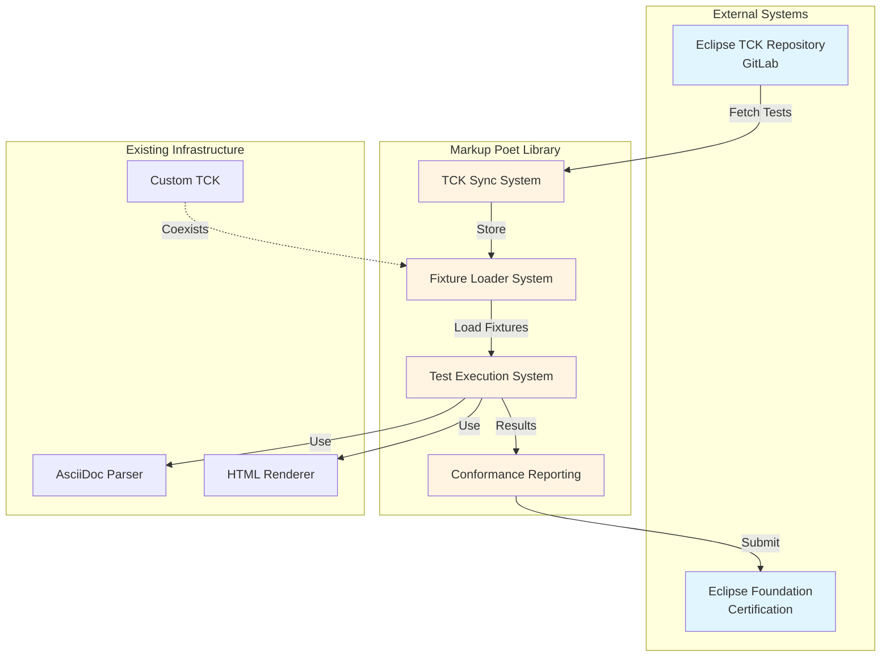
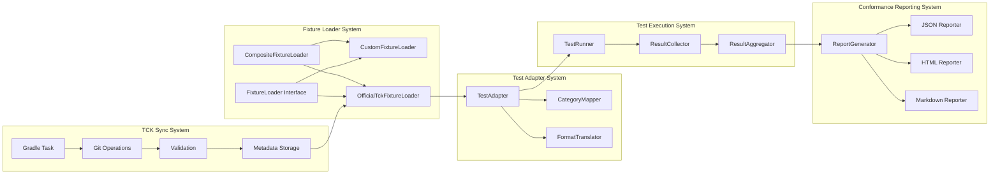

# Design Document: Official AsciiDoc TCK Integration

## Important: Kotlin-Only Implementation Approach

**The official Eclipse AsciiDoc TCK is a JavaScript-based test harness.** This project strictly avoids Ruby and JavaScript tools for the Kotlin Multiplatform implementation.

**Our Design Philosophy:**
1. **Test Data Extraction**: Sync the official TCK repository to access canonical test cases (input.adoc, output.json files)
2. **Pure Kotlin Implementation**: All parsing, loading, execution, and reporting is implemented in Kotlin
3. **No JavaScript Execution**: The JavaScript test harness in the official TCK is not used
4. **Platform-Native Tools**: Use JGit (Java) for JVM, native git for iOS/Linux - no Node.js
5. **Data Format Compatibility**: Parse the official test data format using kotlinx.serialization

**What We Use from Official TCK:**
- ✅ Test input files (*.adoc)
- ✅ Expected output files (*.json)
- ✅ Directory structure for categorization
- ✅ Test case organization

**What We DON'T Use from Official TCK:**
- ❌ JavaScript test harness (harness/lib/)
- ❌ Node.js dependencies (package.json)
- ❌ JavaScript test runner
- ❌ Any JavaScript execution

---

## Overview

This design document specifies the architecture and implementation approach for integrating the official Eclipse Foundation AsciiDoc Technology Compatibility Kit (TCK) into the Markup Poet AsciiDoc converter library. The integration enables validation of specification conformance, tracks progress toward certification, and maintains dual support for both custom and official test formats.

The design follows a modular, extensible architecture that preserves the existing custom TCK infrastructure while adding official test support. Key design principles include:

1. **Non-Breaking Integration**: Existing custom TCK functionality remains unchanged
2. **Format Flexibility**: Support multiple test formats through abstraction
3. **Platform Consistency**: Official tests run on all KMP platforms (JVM, Android, iOS, Linux)
4. **Incremental Adoption**: Official tests can be enabled gradually as features are implemented
5. **Certification Focus**: Clear path to official AsciiDoc processor certification

### System Context



## Architecture

### Component Overview

The official TCK integration consists of five major subsystems:

1. **TCK Sync System**: Fetches and updates official test cases from Eclipse GitLab
2. **Fixture Loader System**: Loads and parses test fixtures from multiple formats
3. **Test Adapter System**: Translates official tests to internal representation
4. **Test Execution System**: Runs tests across all platforms with result collection
5. **Conformance Reporting System**: Generates certification-ready reports



### Directory Structure

```
tck-quality-testing/
├── official-tck/                          # Official TCK data (gitignored)
│   ├── repository/                        # Cloned official TCK repo
│   ├── version.txt                        # Current TCK version
│   ├── commit-hash.txt                    # Current commit hash
│   ├── sync-metadata.json                 # Sync operation metadata
│   └── sync-log.json                      # Historical sync log
├── fixtures/                              # Custom fixtures (existing)
│   ├── blocks/
│   ├── inline/
│   └── conformance/
├── conformance-reports/                   # Generated reports (gitignored)
│   ├── latest.json
│   ├── latest.html
│   ├── latest.md
│   └── history/
├── src/
│   ├── commonMain/kotlin/org/markup/poet/tck/
│   │   ├── sync/                          # TCK sync components
│   │   │   ├── TckSyncService.kt
│   │   │   ├── GitOperations.kt
│   │   │   ├── SyncValidator.kt
│   │   │   └── SyncMetadata.kt
│   │   ├── fixtures/                      # Fixture loading (existing + new)
│   │   │   ├── FixtureLoader.kt           # Interface (existing)
│   │   │   ├── CustomFixtureLoader.kt     # JSON format (existing)
│   │   │   ├── OfficialTckFixtureLoader.kt # Official format (new)
│   │   │   ├── CompositeFixtureLoader.kt  # Multi-format (new)
│   │   │   └── FormatDetector.kt          # Auto-detection (new)
│   │   ├── adapter/                       # Test adaptation
│   │   │   ├── TestAdapter.kt
│   │   │   ├── CategoryMapper.kt
│   │   │   └── FormatTranslator.kt
│   │   ├── execution/                     # Test execution
│   │   │   ├── TestRunner.kt
│   │   │   ├── ResultCollector.kt
│   │   │   ├── ResultAggregator.kt
│   │   │   └── TestFilter.kt
│   │   ├── conformance/                   # Conformance reporting
│   │   │   ├── ConformanceReport.kt
│   │   │   ├── ReportGenerator.kt
│   │   │   ├── JsonReporter.kt
│   │   │   ├── HtmlReporter.kt
│   │   │   ├── MarkdownReporter.kt
│   │   │   └── CertificationChecker.kt
│   │   ├── config/                        # Configuration
│   │   │   ├── TckConfig.kt
│   │   │   └── ConfigLoader.kt
│   │   └── version/                       # Version tracking
│   │       ├── VersionTracker.kt
│   │       ├── ChangeDetector.kt
│   │       └── VersionComparator.kt
│   ├── commonTest/kotlin/org/markup/poet/tck/
│   │   ├── official/                      # Official TCK tests
│   │   │   ├── OfficialCompatibilityTest.kt
│   │   │   └── OfficialConformanceTest.kt
│   │   └── integration/                   # Integration tests
│   │       ├── SyncIntegrationTest.kt
│   │       └── DualFormatTest.kt
│   └── jvmMain/kotlin/org/markup/poet/tck/
│       └── gradle/                        # Gradle task implementations
│           ├── SyncOfficialTckTask.kt
│           ├── RunOfficialTestsTask.kt
│           └── GenerateConformanceReportTask.kt
├── build.gradle.kts                       # Gradle configuration
└── tck-config.json                        # TCK configuration file
```

## Components and Interfaces

### 1. TCK Sync System

**Purpose**: Fetch, validate, and track official test cases from the Eclipse Foundation repository.

#### 1.1 TckSyncService

```kotlin
package org.markup.poet.tck.sync

import kotlin.time.Duration

/**
 * Service for synchronizing with the official Eclipse AsciiDoc TCK repository.
 */
interface TckSyncService {
    /**
     * Synchronize with the official TCK repository.
     * 
     * @param force If true, force a fresh clone even if repository exists
     * @return Sync result with metadata
     */
    suspend fun sync(force: Boolean = false): SyncResult
    
    /**
     * Check if local TCK is up-to-date with remote.
     * 
     * @return Sync status information
     */
    suspend fun checkSyncStatus(): SyncStatus
    
    /**
     * Validate the integrity of the local TCK repository.
     * 
     * @return Validation result
     */
    fun validateRepository(): ValidationResult
}

/**
 * Result of a sync operation.
 */
data class SyncResult(
    val success: Boolean,
    val metadata: SyncMetadata,
    val changeReport: ChangeReport? = null,
    val errors: List<SyncError> = emptyList()
)

/**
 * Metadata about a sync operation.
 */
data class SyncMetadata(
    val timestamp: Long,
    val specVersion: String,
    val commitHash: String,
    val repositoryUrl: String,
    val testCount: Int,
    val duration: Duration
)

/**
 * Status of TCK synchronization.
 */
data class SyncStatus(
    val isSynced: Boolean,
    val isOutdated: Boolean,
    val localVersion: String?,
    val remoteVersion: String?,
    val lastSyncTimestamp: Long?,
    val message: String
)

/**
 * Report of changes between TCK versions.
 */
data class ChangeReport(
    val addedTests: List<String>,
    val modifiedTests: List<String>,
    val removedTests: List<String>,
    val versionChange: VersionChange?
)

data class VersionChange(
    val from: String,
    val to: String
)

/**
 * Error during sync operation.
 */
data class SyncError(
    val type: SyncErrorType,
    val message: String,
    val resolutionSteps: List<String>,
    val cause: Throwable? = null
)

enum class SyncErrorType {
    NETWORK_ERROR,
    GIT_ERROR,
    VALIDATION_ERROR,
    PERMISSION_ERROR,
    UNKNOWN_ERROR
}

/**
 * Result of repository validation.
 */
sealed class ValidationResult {
    data class Valid(val testCount: Int) : ValidationResult()
    data class Invalid(val errors: List<String>) : ValidationResult()
}
```

#### 1.2 GitOperations

```kotlin
package org.markup.poet.tck.sync

/**
 * Git operations for TCK repository management.
 * Platform-specific implementation using JGit or native git.
 */
interface GitOperations {
    /**
     * Clone the TCK repository.
     */
    suspend fun clone(url: String, destination: String, branch: String? = null): GitResult
    
    /**
     * Pull latest changes from remote.
     */
    suspend fun pull(repositoryPath: String): GitResult
    
    /**
     * Get current commit hash.
     */
    fun getCurrentCommitHash(repositoryPath: String): String?
    
    /**
     * Get current branch or tag.
     */
    fun getCurrentRef(repositoryPath: String): String?
    
    /**
     * Check if repository exists and is valid.
     */
    fun isValidRepository(repositoryPath: String): Boolean
}

/**
 * Result of a git operation.
 */
sealed class GitResult {
    data class Success(val message: String) : GitResult()
    data class Failure(val error: String, val cause: Throwable? = null) : GitResult()
}

/**
 * Platform-specific git operations implementation.
 */
expect class PlatformGitOperations() : GitOperations
```

#### 1.3 SyncValidator

```kotlin
package org.markup.poet.tck.sync

/**
 * Validates the structure and integrity of the official TCK repository.
 */
interface SyncValidator {
    /**
     * Validate repository structure.
     */
    fun validateStructure(repositoryPath: String): ValidationResult
    
    /**
     * Validate individual test files.
     */
    fun validateTestFiles(repositoryPath: String): List<TestFileValidation>
    
    /**
     * Validate metadata files (version, manifest, etc.).
     */
    fun validateMetadata(repositoryPath: String): ValidationResult
}

/**
 * Validation result for a single test file.
 */
data class TestFileValidation(
    val filePath: String,
    val isValid: Boolean,
    val errors: List<String> = emptyList()
)

class DefaultSyncValidator : SyncValidator {
    override fun validateStructure(repositoryPath: String): ValidationResult {
        // Check for required directories and files
        // Verify repository structure matches expected format
        TODO("Implementation")
    }
    
    override fun validateTestFiles(repositoryPath: String): List<TestFileValidation> {
        // Validate each test file format
        // Check for required fields
        // Verify file integrity
        TODO("Implementation")
    }
    
    override fun validateMetadata(repositoryPath: String): ValidationResult {
        // Validate version file
        // Check manifest if present
        // Verify metadata consistency
        TODO("Implementation")
    }
}
```

### 2. Fixture Loader System

**Purpose**: Load test fixtures from multiple formats with automatic format detection.

#### 2.1 Enhanced FixtureLoader Interface

```kotlin
package org.markup.poet.tck.fixtures

/**
 * Extended fixture loader interface supporting multiple formats.
 */
interface FixtureLoader {
    /**
     * Load a specific fixture by ID.
     */
    fun loadFixture(id: String): TestFixture
    
    /**
     * Load all fixtures in a category.
     */
    fun loadFixturesByCategory(category: FixtureCategory): List<TestFixture>
    
    /**
     * Load all available fixtures.
     */
    fun loadAllFixtures(): List<TestFixture>
    
    /**
     * Check if this loader supports the given file/path.
     */
    fun supports(path: String): Boolean
    
    /**
     * Get the format this loader handles.
     */
    fun getFormat(): FixtureFormat
}

enum class FixtureFormat {
    CUSTOM_JSON,
    OFFICIAL_TCK,
    UNKNOWN
}
```

#### 2.2 OfficialTckFixtureLoader

```kotlin
package org.markup.poet.tck.fixtures

/**
 * Loader for official Eclipse TCK test format.
 * 
 * The official format structure will be determined during implementation
 * based on actual TCK repository analysis. This is a placeholder design.
 */
class OfficialTckFixtureLoader(
    private val tckRepositoryPath: String
) : FixtureLoader {
    
    override fun loadFixture(id: String): TestFixture {
        // Parse official test file
        // Extract metadata, input, expected output
        // Map to internal TestFixture format
        TODO("Implementation based on official format analysis")
    }
    
    override fun loadFixturesByCategory(category: FixtureCategory): List<TestFixture> {
        // Find all official tests in category
        // Load and convert each
        TODO("Implementation")
    }
    
    override fun loadAllFixtures(): List<TestFixture> {
        // Scan TCK repository
        // Load all test files
        // Convert to internal format
        TODO("Implementation")
    }
    
    override fun supports(path: String): Boolean {
        // Check if path is in official TCK format
        // Detect by file structure or metadata
        return path.startsWith(tckRepositoryPath)
    }
    
    override fun getFormat(): FixtureFormat = FixtureFormat.OFFICIAL_TCK
    
    /**
     * Parse official test file format.
     * Format TBD based on actual TCK analysis.
     */
    private fun parseOfficialTest(filePath: String): OfficialTestData {
        TODO("Implementation")
    }
    
    /**
     * Convert official test data to internal fixture format.
     */
    private fun convertToFixture(officialTest: OfficialTestData): TestFixture {
        TODO("Implementation")
    }
}

/**
 * Represents official TCK test data.
 * Structure TBD based on actual format analysis.
 */
data class OfficialTestData(
    val testId: String,
    val description: String,
    val specReference: String,
    val input: String,
    val expectedOutput: String?,
    val attributes: Map<String, String>,
    val category: String,
    val metadata: Map<String, Any>
)
```

#### 2.3 CompositeFixtureLoader

```kotlin
package org.markup.poet.tck.fixtures

/**
 * Composite loader that delegates to appropriate format-specific loaders.
 */
class CompositeFixtureLoader(
    private val loaders: List<FixtureLoader>,
    private val formatDetector: FormatDetector
) : FixtureLoader {
    
    override fun loadFixture(id: String): TestFixture {
        // Try each loader until one succeeds
        for (loader in loaders) {
            try {
                return loader.loadFixture(id)
            } catch (e: FixtureNotFoundException) {
                continue
            }
        }
        throw FixtureNotFoundException(id)
    }
    
    override fun loadFixturesByCategory(category: FixtureCategory): List<TestFixture> {
        // Aggregate fixtures from all loaders
        return loaders.flatMap { it.loadFixturesByCategory(category) }
    }
    
    override fun loadAllFixtures(): List<TestFixture> {
        // Aggregate all fixtures from all loaders
        return loaders.flatMap { it.loadAllFixtures() }
    }
    
    override fun supports(path: String): Boolean {
        return loaders.any { it.supports(path) }
    }
    
    override fun getFormat(): FixtureFormat = FixtureFormat.UNKNOWN
}

class FixtureNotFoundException(val fixtureId: String) : Exception("Fixture not found: $fixtureId")
```

#### 2.4 FormatDetector

```kotlin
package org.markup.poet.tck.fixtures

/**
 * Detects test fixture format based on file structure and metadata.
 */
interface FormatDetector {
    /**
     * Detect the format of a test file.
     */
    fun detectFormat(filePath: String): FixtureFormat
    
    /**
     * Detect format from file content.
     */
    fun detectFormatFromContent(content: String): FixtureFormat
}

class DefaultFormatDetector : FormatDetector {
    override fun detectFormat(filePath: String): FixtureFormat {
        // Check file extension
        // Check directory structure
        // Parse and inspect content
        return when {
            filePath.contains("/official-tck/") -> FixtureFormat.OFFICIAL_TCK
            filePath.endsWith(".json") -> FixtureFormat.CUSTOM_JSON
            else -> FixtureFormat.UNKNOWN
        }
    }
    
    override fun detectFormatFromContent(content: String): FixtureFormat {
        // Try parsing as JSON (custom format)
        // Try parsing as official format
        // Return detected format
        TODO("Implementation")
    }
}
```

### 3. Test Adapter System

**Purpose**: Translate official test format to internal representation and map categories.

#### 3.1 TestAdapter

```kotlin
package org.markup.poet.tck.adapter

import org.markup.poet.tck.fixtures.TestFixture
import org.markup.poet.tck.fixtures.OfficialTestData

/**
 * Adapts official TCK tests to internal test representation.
 */
interface TestAdapter {
    /**
     * Adapt official test to internal fixture format.
     */
    fun adapt(officialTest: OfficialTestData): TestFixture
    
    /**
     * Adapt multiple official tests.
     */
    fun adaptAll(officialTests: List<OfficialTestData>): List<TestFixture>
}

class DefaultTestAdapter(
    private val categoryMapper: CategoryMapper,
    private val formatTranslator: FormatTranslator
) : TestAdapter {
    
    override fun adapt(officialTest: OfficialTestData): TestFixture {
        return TestFixture(
            id = "official-${officialTest.testId}",
            category = categoryMapper.mapCategory(officialTest.category),
            description = officialTest.description,
            input = formatTranslator.translateInput(officialTest.input),
            expectedOutput = officialTest.expectedOutput?.let { 
                formatTranslator.translateOutput(it) 
            },
            metadata = buildMetadata(officialTest)
        )
    }
    
    override fun adaptAll(officialTests: List<OfficialTestData>): List<TestFixture> {
        return officialTests.map { adapt(it) }
    }
    
    private fun buildMetadata(officialTest: OfficialTestData): Map<String, String> {
        return mapOf(
            "source" to "official-tck",
            "spec_reference" to officialTest.specReference,
            "official_id" to officialTest.testId
        ) + officialTest.attributes
    }
}
```

#### 3.2 CategoryMapper

```kotlin
package org.markup.poet.tck.adapter

import org.markup.poet.tck.fixtures.FixtureCategory

/**
 * Maps official TCK categories to internal fixture categories.
 */
interface CategoryMapper {
    /**
     * Map official category to internal category.
     */
    fun mapCategory(officialCategory: String): FixtureCategory
    
    /**
     * Get all category mappings.
     */
    fun getAllMappings(): Map<String, FixtureCategory>
}

class DefaultCategoryMapper : CategoryMapper {
    private val mappings = mapOf(
        "blocks/paragraph" to FixtureCategory.BLOCK_PARAGRAPH,
        "blocks/heading" to FixtureCategory.BLOCK_HEADING,
        "blocks/list" to FixtureCategory.BLOCK_LIST,
        "blocks/table" to FixtureCategory.BLOCK_TABLE,
        "blocks/code" to FixtureCategory.BLOCK_CODE,
        "blocks/quote" to FixtureCategory.BLOCK_QUOTE,
        "inline/bold" to FixtureCategory.INLINE_BOLD,
        "inline/italic" to FixtureCategory.INLINE_ITALIC,
        "inline/monospace" to FixtureCategory.INLINE_MONOSPACE,
        "attributes" to FixtureCategory.ATTRIBUTE,
        "macros" to FixtureCategory.MACRO,
        "cross-references" to FixtureCategory.CROSS_REFERENCE,
        "includes" to FixtureCategory.INCLUDE,
        "conformance" to FixtureCategory.CONFORMANCE
    )
    
    override fun mapCategory(officialCategory: String): FixtureCategory {
        return mappings[officialCategory] ?: FixtureCategory.CONFORMANCE
    }
    
    override fun getAllMappings(): Map<String, FixtureCategory> = mappings
}
```

#### 3.3 FormatTranslator

```kotlin
package org.markup.poet.tck.adapter

/**
 * Translates between official TCK format and internal format.
 */
interface FormatTranslator {
    /**
     * Translate official input format to internal format.
     */
    fun translateInput(officialInput: String): String
    
    /**
     * Translate official output format to internal format.
     */
    fun translateOutput(officialOutput: String): String
}

class DefaultFormatTranslator : FormatTranslator {
    override fun translateInput(officialInput: String): String {
        // Most likely no translation needed
        // Official TCK should use standard AsciiDoc
        return officialInput
    }
    
    override fun translateOutput(officialOutput: String): String {
        // May need normalization or format conversion
        // Depends on official TCK output format
        return officialOutput
    }
}
```

### 4. Test Execution System

**Purpose**: Execute tests across all platforms and collect results.

#### 4.1 TestRunner

```kotlin
package org.markup.poet.tck.execution

import org.markup.poet.tck.fixtures.TestFixture
import kotlin.time.Duration

/**
 * Executes test fixtures and collects results.
 */
interface TestRunner {
    /**
     * Run a single test fixture.
     */
    fun runTest(fixture: TestFixture): TestExecutionResult
    
    /**
     * Run multiple test fixtures.
     */
    fun runTests(fixtures: List<TestFixture>): List<TestExecutionResult>
    
    /**
     * Run tests with filtering.
     */
    fun runTestsFiltered(
        fixtures: List<TestFixture>,
        filter: TestFilter
    ): List<TestExecutionResult>
}

/**
 * Result of executing a single test.
 */
data class TestExecutionResult(
    val fixtureId: String,
    val status: TestStatus,
    val platform: String,
    val duration: Duration,
    val errorMessage: String? = null,
    val stackTrace: String? = null,
    val actualOutput: String? = null,
    val expectedOutput: String? = null,
    val diff: String? = null
)

enum class TestStatus {
    PASSED,
    FAILED,
    SKIPPED,
    PENDING,
    ERROR
}

class DefaultTestRunner(
    private val parser: (String) -> Any,
    private val renderer: (Any) -> String,
    private val validator: OutputValidator
) : TestRunner {
    
    override fun runTest(fixture: TestFixture): TestExecutionResult {
        val startTime = kotlin.time.TimeSource.Monotonic.markNow()
        
        return try {
            val parsed = parser(fixture.input)
            val rendered = renderer(parsed)
            
            val status = if (fixture.expectedOutput != null) {
                val validationResult = validator.validate(fixture.expectedOutput, rendered)
                when (validationResult) {
                    is ValidationResult.Success -> TestStatus.PASSED
                    is ValidationResult.Failure -> TestStatus.FAILED
                }
            } else {
                TestStatus.PASSED // No expected output to validate
            }
            
            TestExecutionResult(
                fixtureId = fixture.id,
                status = status,
                platform = getPlatformName(),
                duration = startTime.elapsedNow(),
                actualOutput = rendered,
                expectedOutput = fixture.expectedOutput
            )
        } catch (e: PendingTestException) {
            TestExecutionResult(
                fixtureId = fixture.id,
                status = TestStatus.PENDING,
                platform = getPlatformName(),
                duration = startTime.elapsedNow(),
                errorMessage = e.message
            )
        } catch (e: Exception) {
            TestExecutionResult(
                fixtureId = fixture.id,
                status = TestStatus.ERROR,
                platform = getPlatformName(),
                duration = startTime.elapsedNow(),
                errorMessage = e.message,
                stackTrace = e.stackTraceToString()
            )
        }
    }
    
    override fun runTests(fixtures: List<TestFixture>): List<TestExecutionResult> {
        return fixtures.map { runTest(it) }
    }
    
    override fun runTestsFiltered(
        fixtures: List<TestFixture>,
        filter: TestFilter
    ): List<TestExecutionResult> {
        val filtered = fixtures.filter { filter.shouldRun(it) }
        return runTests(filtered)
    }
    
    private fun getPlatformName(): String {
        // Platform-specific implementation
        return "unknown"
    }
}

expect fun getPlatformName(): String
```

#### 4.2 TestFilter

```kotlin
package org.markup.poet.tck.execution

import org.markup.poet.tck.fixtures.TestFixture
import org.markup.poet.tck.fixtures.FixtureCategory

/**
 * Filters tests based on various criteria.
 */
interface TestFilter {
    /**
     * Determine if a test should run.
     */
    fun shouldRun(fixture: TestFixture): Boolean
}

/**
 * Filter by fixture category.
 */
class CategoryFilter(
    private val allowedCategories: Set<FixtureCategory>
) : TestFilter {
    override fun shouldRun(fixture: TestFixture): Boolean {
        return fixture.category in allowedCategories
    }
}

/**
 * Filter by test source (custom vs official).
 */
class SourceFilter(
    private val allowCustom: Boolean = true,
    private val allowOfficial: Boolean = true
) : TestFilter {
    override fun shouldRun(fixture: TestFixture): Boolean {
        val source = fixture.metadata["source"] ?: "custom"
        return when (source) {
            "official-tck" -> allowOfficial
            "custom" -> allowCustom
            else -> true
        }
    }
}

/**
 * Filter by spec section.
 */
class SpecSectionFilter(
    private val allowedSections: Set<String>
) : TestFilter {
    override fun shouldRun(fixture: TestFixture): Boolean {
        val section = fixture.metadata["spec_section"] ?: return true
        return section in allowedSections
    }
}

/**
 * Composite filter that combines multiple filters.
 */
class CompositeFilter(
    private val filters: List<TestFilter>,
    private val mode: FilterMode = FilterMode.AND
) : TestFilter {
    
    enum class FilterMode {
        AND, // All filters must pass
        OR   // At least one filter must pass
    }
    
    override fun shouldRun(fixture: TestFixture): Boolean {
        return when (mode) {
            FilterMode.AND -> filters.all { it.shouldRun(fixture) }
            FilterMode.OR -> filters.any { it.shouldRun(fixture) }
        }
    }
}
```

#### 4.3 ResultCollector and ResultAggregator

```kotlin
package org.markup.poet.tck.execution

/**
 * Collects test results from multiple platforms.
 */
interface ResultCollector {
    /**
     * Add results from a test run.
     */
    fun addResults(results: List<TestExecutionResult>)
    
    /**
     * Get all collected results.
     */
    fun getAllResults(): List<TestExecutionResult>
    
    /**
     * Clear all collected results.
     */
    fun clear()
}

class InMemoryResultCollector : ResultCollector {
    private val results = mutableListOf<TestExecutionResult>()
    
    override fun addResults(results: List<TestExecutionResult>) {
        this.results.addAll(results)
    }
    
    override fun getAllResults(): List<TestExecutionResult> = results.toList()
    
    override fun clear() {
        results.clear()
    }
}

/**
 * Aggregates results across platforms and categories.
 */
interface ResultAggregator {
    /**
     * Aggregate results into summary statistics.
     */
    fun aggregate(results: List<TestExecutionResult>): AggregatedResults
}

/**
 * Aggregated test results with statistics.
 */
data class AggregatedResults(
    val totalTests: Int,
    val passed: Int,
    val failed: Int,
    val skipped: Int,
    val pending: Int,
    val errors: Int,
    val byPlatform: Map<String, PlatformResults>,
    val byCategory: Map<FixtureCategory, CategoryResults>,
    val bySource: Map<String, SourceResults>,
    val failedTests: List<TestExecutionResult>,
    val pendingTests: List<TestExecutionResult>
)

data class PlatformResults(
    val platform: String,
    val total: Int,
    val passed: Int,
    val failed: Int,
    val passRate: Double
)

data class CategoryResults(
    val category: FixtureCategory,
    val total: Int,
    val passed: Int,
    val failed: Int,
    val passRate: Double
)

data class SourceResults(
    val source: String,
    val total: Int,
    val passed: Int,
    val failed: Int,
    val passRate: Double
)

class DefaultResultAggregator : ResultAggregator {
    override fun aggregate(results: List<TestExecutionResult>): AggregatedResults {
        val totalTests = results.size
        val passed = results.count { it.status == TestStatus.PASSED }
        val failed = results.count { it.status == TestStatus.FAILED }
        val skipped = results.count { it.status == TestStatus.SKIPPED }
        val pending = results.count { it.status == TestStatus.PENDING }
        val errors = results.count { it.status == TestStatus.ERROR }
        
        val byPlatform = results.groupBy { it.platform }
            .mapValues { (platform, platformResults) ->
                PlatformResults(
                    platform = platform,
                    total = platformResults.size,
                    passed = platformResults.count { it.status == TestStatus.PASSED },
                    failed = platformResults.count { it.status == TestStatus.FAILED },
                    passRate = platformResults.count { it.status == TestStatus.PASSED }.toDouble() / platformResults.size
                )
            }
        
        // Additional aggregations would be implemented here
        
        return AggregatedResults(
            totalTests = totalTests,
            passed = passed,
            failed = failed,
            skipped = skipped,
            pending = pending,
            errors = errors,
            byPlatform = byPlatform,
            byCategory = emptyMap(), // TODO: Implement
            bySource = emptyMap(), // TODO: Implement
            failedTests = results.filter { it.status == TestStatus.FAILED },
            pendingTests = results.filter { it.status == TestStatus.PENDING }
        )
    }
}
```

### 5. Conformance Reporting System

**Purpose**: Generate certification-ready conformance reports in multiple formats.

#### 5.1 ConformanceReport Data Model

```kotlin
package org.markup.poet.tck.conformance

import kotlin.time.Duration

/**
 * Complete conformance report for certification.
 */
data class ConformanceReport(
    val metadata: ReportMetadata,
    val summary: ConformanceSummary,
    val platformResults: List<PlatformConformance>,
    val categoryResults: List<CategoryConformance>,
    val specSectionResults: List<SpecSectionConformance>,
    val failedTests: List<FailedTestDetail>,
    val pendingTests: List<PendingTestDetail>,
    val certificationStatus: CertificationStatus
)

data class ReportMetadata(
    val generatedAt: Long,
    val specVersion: String,
    val tckCommitHash: String,
    val libraryVersion: String,
    val platforms: List<String>
)

data class ConformanceSummary(
    val totalTests: Int,
    val passed: Int,
    val failed: Int,
    val pending: Int,
    val skipped: Int,
    val overallPassRate: Double,
    val officialTestsPassRate: Double,
    val customTestsPassRate: Double,
    val totalDuration: Duration
)

data class PlatformConformance(
    val platform: String,
    val totalTests: Int,
    val passed: Int,
    val failed: Int,
    val passRate: Double,
    val failedTestIds: List<String>
)

data class CategoryConformance(
    val category: String,
    val totalTests: Int,
    val passed: Int,
    val failed: Int,
    val passRate: Double,
    val specSection: String?
)

data class SpecSectionConformance(
    val section: String,
    val title: String,
    val totalTests: Int,
    val passed: Int,
    val failed: Int,
    val passRate: Double,
    val requiredForCertification: Boolean
)

data class FailedTestDetail(
    val testId: String,
    val description: String,
    val category: String,
    val specSection: String,
    val platforms: List<String>,
    val errorMessage: String,
    val expectedOutput: String?,
    val actualOutput: String?
)

data class PendingTestDetail(
    val testId: String,
    val description: String,
    val category: String,
    val specSection: String,
    val reason: String
)

data class CertificationStatus(
    val isReady: Boolean,
    val overallProgress: Double,
    val blockingIssues: List<BlockingIssue>,
    val recommendations: List<String>
)

data class BlockingIssue(
    val severity: IssueSeverity,
    val description: String,
    val affectedTests: List<String>,
    val resolution: String
)

enum class IssueSeverity {
    CRITICAL,
    HIGH,
    MEDIUM,
    LOW
}
```

#### 5.2 ReportGenerator

```kotlin
package org.markup.poet.tck.conformance

import org.markup.poet.tck.execution.AggregatedResults

/**
 * Generates conformance reports from aggregated test results.
 */
interface ReportGenerator {
    /**
     * Generate a complete conformance report.
     */
    fun generateReport(
        results: AggregatedResults,
        metadata: ReportMetadata
    ): ConformanceReport
}

class DefaultReportGenerator(
    private val certificationChecker: CertificationChecker
) : ReportGenerator {
    
    override fun generateReport(
        results: AggregatedResults,
        metadata: ReportMetadata
    ): ConformanceReport {
        val summary = buildSummary(results)
        val platformResults = buildPlatformResults(results)
        val categoryResults = buildCategoryResults(results)
        val specSectionResults = buildSpecSectionResults(results)
        val failedTests = buildFailedTestDetails(results)
        val pendingTests = buildPendingTestDetails(results)
        val certificationStatus = certificationChecker.checkStatus(results)
        
        return ConformanceReport(
            metadata = metadata,
            summary = summary,
            platformResults = platformResults,
            categoryResults = categoryResults,
            specSectionResults = specSectionResults,
            failedTests = failedTests,
            pendingTests = pendingTests,
            certificationStatus = certificationStatus
        )
    }
    
    private fun buildSummary(results: AggregatedResults): ConformanceSummary {
        // Build summary from aggregated results
        TODO("Implementation")
    }
    
    private fun buildPlatformResults(results: AggregatedResults): List<PlatformConformance> {
        // Build platform-specific results
        TODO("Implementation")
    }
    
    private fun buildCategoryResults(results: AggregatedResults): List<CategoryConformance> {
        // Build category-specific results
        TODO("Implementation")
    }
    
    private fun buildSpecSectionResults(results: AggregatedResults): List<SpecSectionConformance> {
        // Build spec section results
        TODO("Implementation")
    }
    
    private fun buildFailedTestDetails(results: AggregatedResults): List<FailedTestDetail> {
        // Extract detailed failure information
        TODO("Implementation")
    }
    
    private fun buildPendingTestDetails(results: AggregatedResults): List<PendingTestDetail> {
        // Extract pending test information
        TODO("Implementation")
    }
}
```

#### 5.3 Format-Specific Reporters

```kotlin
package org.markup.poet.tck.conformance

/**
 * Generates JSON format conformance reports.
 */
interface JsonReporter {
    fun generateJson(report: ConformanceReport): String
}

/**
 * Generates HTML format conformance reports.
 */
interface HtmlReporter {
    fun generateHtml(report: ConformanceReport): String
}

/**
 * Generates Markdown format conformance reports.
 */
interface MarkdownReporter {
    fun generateMarkdown(report: ConformanceReport): String
}

class DefaultJsonReporter : JsonReporter {
    override fun generateJson(report: ConformanceReport): String {
        // Serialize to JSON using kotlinx.serialization
        TODO("Implementation")
    }
}

class DefaultHtmlReporter : HtmlReporter {
    override fun generateHtml(report: ConformanceReport): String {
        // Generate HTML with styling
        // Include charts and visualizations
        TODO("Implementation")
    }
}

class DefaultMarkdownReporter : MarkdownReporter {
    override fun generateMarkdown(report: ConformanceReport): String {
        // Generate Markdown with tables
        // Include summary and details
        TODO("Implementation")
    }
}
```

#### 5.4 CertificationChecker

```kotlin
package org.markup.poet.tck.conformance

import org.markup.poet.tck.execution.AggregatedResults

/**
 * Checks certification readiness and identifies blocking issues.
 */
interface CertificationChecker {
    /**
     * Check if the implementation is ready for certification.
     */
    fun checkStatus(results: AggregatedResults): CertificationStatus
    
    /**
     * Get certification requirements.
     */
    fun getRequirements(): List<CertificationRequirement>
}

data class CertificationRequirement(
    val id: String,
    val description: String,
    val required: Boolean,
    val met: Boolean
)

class DefaultCertificationChecker : CertificationChecker {
    override fun checkStatus(results: AggregatedResults): CertificationStatus {
        val blockingIssues = identifyBlockingIssues(results)
        val progress = calculateProgress(results)
        val isReady = blockingIssues.isEmpty() && progress >= 100.0
        val recommendations = generateRecommendations(results, blockingIssues)
        
        return CertificationStatus(
            isReady = isReady,
            overallProgress = progress,
            blockingIssues = blockingIssues,
            recommendations = recommendations
        )
    }
    
    override fun getRequirements(): List<CertificationRequirement> {
        return listOf(
            CertificationRequirement(
                id = "official-tests-100",
                description = "100% of official TCK tests must pass",
                required = true,
                met = false
            ),
            CertificationRequirement(
                id = "all-platforms",
                description = "Tests must pass on all supported platforms",
                required = true,
                met = false
            ),
            CertificationRequirement(
                id = "spec-compliance",
                description = "All required spec sections must be implemented",
                required = true,
                met = false
            )
        )
    }
    
    private fun identifyBlockingIssues(results: AggregatedResults): List<BlockingIssue> {
        // Analyze results to find blocking issues
        TODO("Implementation")
    }
    
    private fun calculateProgress(results: AggregatedResults): Double {
        // Calculate overall progress toward certification
        return (results.passed.toDouble() / results.totalTests) * 100.0
    }
    
    private fun generateRecommendations(
        results: AggregatedResults,
        blockingIssues: List<BlockingIssue>
    ): List<String> {
        // Generate actionable recommendations
        TODO("Implementation")
    }
}
```

### 6. Configuration System

**Purpose**: Manage TCK integration configuration.

```kotlin
package org.markup.poet.tck.config

/**
 * Configuration for official TCK integration.
 */
data class TckConfig(
    val sync: SyncConfig,
    val execution: ExecutionConfig,
    val reporting: ReportingConfig
)

data class SyncConfig(
    val repositoryUrl: String = "https://gitlab.eclipse.org/eclipse/asciidoc-lang/asciidoc-tck.git",
    val branch: String = "main",
    val localPath: String = "tck-quality-testing/official-tck/repository",
    val autoSync: Boolean = false,
    val syncFrequency: SyncFrequency = SyncFrequency.MANUAL
)

enum class SyncFrequency {
    MANUAL,
    ON_BUILD,
    DAILY,
    WEEKLY
}

data class ExecutionConfig(
    val enableOfficialTests: Boolean = true,
    val enableCustomTests: Boolean = true,
    val parallelExecution: Boolean = true,
    val testTimeout: kotlin.time.Duration = kotlin.time.Duration.parse("30s"),
    val allowedCategories: Set<String> = emptySet(), // Empty = all
    val excludedCategories: Set<String> = emptySet()
)

data class ReportingConfig(
    val outputDirectory: String = "tck-quality-testing/conformance-reports",
    val generateJson: Boolean = true,
    val generateHtml: Boolean = true,
    val generateMarkdown: Boolean = true,
    val includeStackTraces: Boolean = true,
    val includeDiffs: Boolean = true
)

/**
 * Loads TCK configuration from file.
 */
interface ConfigLoader {
    fun loadConfig(path: String = "tck-quality-testing/tck-config.json"): TckConfig
    fun saveConfig(config: TckConfig, path: String = "tck-quality-testing/tck-config.json")
}

class JsonConfigLoader : ConfigLoader {
    override fun loadConfig(path: String): TckConfig {
        // Load from JSON file
        // Use defaults if file doesn't exist
        TODO("Implementation")
    }
    
    override fun saveConfig(config: TckConfig, path: String) {
        // Save to JSON file
        TODO("Implementation")
    }
}
```

### 7. Version Tracking System

**Purpose**: Track TCK versions and detect changes.

```kotlin
package org.markup.poet.tck.version

/**
 * Tracks official TCK version and detects changes.
 */
interface VersionTracker {
    /**
     * Get current local TCK version.
     */
    fun getCurrentVersion(): TckVersion?
    
    /**
     * Update version information after sync.
     */
    fun updateVersion(version: TckVersion)
    
    /**
     * Get version history.
     */
    fun getVersionHistory(): List<TckVersion>
}

data class TckVersion(
    val specVersion: String,
    val commitHash: String,
    val timestamp: Long,
    val testCount: Int
)

/**
 * Detects changes between TCK versions.
 */
interface ChangeDetector {
    /**
     * Detect changes between two versions.
     */
    fun detectChanges(oldVersion: TckVersion, newVersion: TckVersion): ChangeReport
    
    /**
     * Check if local version is outdated.
     */
    suspend fun isOutdated(localVersion: TckVersion): Boolean
}

/**
 * Compares TCK versions.
 */
interface VersionComparator {
    /**
     * Compare two spec versions.
     */
    fun compare(v1: String, v2: String): Int
    
    /**
     * Check if version is compatible.
     */
    fun isCompatible(version: String, requiredVersion: String): Boolean
}
```

### 8. Gradle Task Implementations

**Purpose**: Provide Gradle tasks for TCK operations.

```kotlin
package org.markup.poet.tck.gradle

import org.gradle.api.DefaultTask
import org.gradle.api.tasks.TaskAction

/**
 * Gradle task to sync official TCK repository.
 */
abstract class SyncOfficialTckTask : DefaultTask() {
    
    init {
        group = "tck"
        description = "Synchronize with official Eclipse AsciiDoc TCK repository"
    }
    
    @TaskAction
    fun sync() {
        // Load configuration
        // Execute sync
        // Report results
        TODO("Implementation")
    }
}

/**
 * Gradle task to run official TCK tests.
 */
abstract class RunOfficialTestsTask : DefaultTask() {
    
    init {
        group = "tck"
        description = "Run official TCK tests"
    }
    
    @TaskAction
    fun runTests() {
        // Load fixtures
        // Execute tests
        // Report results
        TODO("Implementation")
    }
}

/**
 * Gradle task to generate conformance report.
 */
abstract class GenerateConformanceReportTask : DefaultTask() {
    
    init {
        group = "tck"
        description = "Generate conformance report from test results"
    }
    
    @TaskAction
    fun generateReport() {
        // Collect results
        // Generate report
        // Save to file
        TODO("Implementation")
    }
}
```


## Data Models

### Official Test Format

The official TCK test format will be determined through analysis of the Eclipse Foundation repository. Based on common TCK patterns, we anticipate one of these formats:

**Option 1: YAML Format**
```yaml
id: blocks-paragraph-001
description: Simple paragraph with plain text
spec_reference: "AsciiDoc Spec Section 3.2.1"
category: blocks/paragraph
input: |
  This is a simple paragraph.
expected_output: |
  <p>This is a simple paragraph.</p>
attributes:
  difficulty: basic
  required_for_certification: true
```

**Option 2: JSON Format**
```json
{
  "id": "blocks-paragraph-001",
  "description": "Simple paragraph with plain text",
  "spec_reference": "AsciiDoc Spec Section 3.2.1",
  "category": "blocks/paragraph",
  "input": "This is a simple paragraph.",
  "expected_output": "<p>This is a simple paragraph.</p>",
  "attributes": {
    "difficulty": "basic",
    "required_for_certification": true
  }
}
```

**Option 3: AsciiDoc Format with Embedded Tests**
```asciidoc
= Test: blocks-paragraph-001

== Description
Simple paragraph with plain text

== Spec Reference
AsciiDoc Spec Section 3.2.1

== Input
----
This is a simple paragraph.
----

== Expected Output
----
<p>This is a simple paragraph.</p>
----
```

The actual implementation will adapt to whichever format is used by the official TCK.

### Sync Metadata Format

Stored in `official-tck/sync-metadata.json`:

```json
{
  "timestamp": 1704067200000,
  "spec_version": "1.0.0",
  "commit_hash": "abc123def456",
  "repository_url": "https://gitlab.eclipse.org/eclipse/asciidoc-lang/asciidoc-tck.git",
  "branch": "main",
  "test_count": 247,
  "duration_ms": 45000,
  "success": true,
  "errors": []
}
```

### Sync Log Format

Stored in `official-tck/sync-log.json`:

```json
{
  "syncs": [
    {
      "timestamp": 1704067200000,
      "spec_version": "1.0.0",
      "commit_hash": "abc123def456",
      "test_count": 247,
      "changes": {
        "added": ["test-001", "test-002"],
        "modified": ["test-050"],
        "removed": []
      }
    }
  ]
}
```

### Conformance Report Format (JSON)

```json
{
  "metadata": {
    "generated_at": 1704067200000,
    "spec_version": "1.0.0",
    "tck_commit_hash": "abc123def456",
    "library_version": "0.1.0",
    "platforms": ["jvm", "android", "ios", "linux"]
  },
  "summary": {
    "total_tests": 247,
    "passed": 198,
    "failed": 35,
    "pending": 14,
    "skipped": 0,
    "overall_pass_rate": 0.801,
    "official_tests_pass_rate": 0.750,
    "custom_tests_pass_rate": 0.900,
    "total_duration_ms": 125000
  },
  "platform_results": [
    {
      "platform": "jvm",
      "total_tests": 247,
      "passed": 210,
      "failed": 23,
      "pass_rate": 0.850,
      "failed_test_ids": ["test-045", "test-089"]
    }
  ],
  "category_results": [
    {
      "category": "blocks/paragraph",
      "total_tests": 45,
      "passed": 42,
      "failed": 3,
      "pass_rate": 0.933,
      "spec_section": "3.2"
    }
  ],
  "spec_section_results": [
    {
      "section": "3.2",
      "title": "Paragraphs",
      "total_tests": 45,
      "passed": 42,
      "failed": 3,
      "pass_rate": 0.933,
      "required_for_certification": true
    }
  ],
  "failed_tests": [
    {
      "test_id": "blocks-paragraph-045",
      "description": "Paragraph with complex inline formatting",
      "category": "blocks/paragraph",
      "spec_section": "3.2.5",
      "platforms": ["jvm", "android"],
      "error_message": "Output mismatch",
      "expected_output": "<p>Expected <strong>bold</strong> text</p>",
      "actual_output": "<p>Expected bold text</p>"
    }
  ],
  "pending_tests": [
    {
      "test_id": "blocks-table-complex",
      "description": "Complex table with merged cells",
      "category": "blocks/table",
      "spec_section": "4.5",
      "reason": "Table parsing not yet implemented"
    }
  ],
  "certification_status": {
    "is_ready": false,
    "overall_progress": 80.1,
    "blocking_issues": [
      {
        "severity": "HIGH",
        "description": "14 tests pending implementation",
        "affected_tests": ["blocks-table-complex", "..."],
        "resolution": "Implement table parsing feature"
      }
    ],
    "recommendations": [
      "Focus on implementing table parsing (14 pending tests)",
      "Fix inline formatting issues (3 failed tests)",
      "Verify cross-reference resolution (2 failed tests)"
    ]
  }
}
```

## API Design

### Public API for TCK Integration

```kotlin
package org.markup.poet.tck

/**
 * Main entry point for TCK integration.
 */
object TckIntegration {
    /**
     * Initialize TCK integration with configuration.
     */
    fun initialize(config: TckConfig = TckConfig.default()): TckContext
    
    /**
     * Sync with official TCK repository.
     */
    suspend fun sync(force: Boolean = false): SyncResult
    
    /**
     * Run all tests (custom + official).
     */
    fun runAllTests(): TestResults
    
    /**
     * Run only official tests.
     */
    fun runOfficialTests(): TestResults
    
    /**
     * Run only custom tests.
     */
    fun runCustomTests(): TestResults
    
    /**
     * Generate conformance report.
     */
    fun generateConformanceReport(): ConformanceReport
}

/**
 * Context for TCK operations.
 */
interface TckContext {
    val config: TckConfig
    val syncService: TckSyncService
    val fixtureLoader: FixtureLoader
    val testRunner: TestRunner
    val reportGenerator: ReportGenerator
}

/**
 * Results from test execution.
 */
data class TestResults(
    val results: List<TestExecutionResult>,
    val aggregated: AggregatedResults
)
```

### Gradle Plugin API

```kotlin
// In build.gradle.kts
plugins {
    id("org.markup.poet.tck") version "0.1.0"
}

tck {
    official {
        enabled = true
        repositoryUrl = "https://gitlab.eclipse.org/eclipse/asciidoc-lang/asciidoc-tck.git"
        branch = "main"
        autoSync = false
    }
    
    execution {
        parallel = true
        timeout = "30s"
        categories {
            include("blocks/*", "inline/*")
            exclude("experimental/*")
        }
    }
    
    reporting {
        outputDir = "conformance-reports"
        formats = listOf("json", "html", "markdown")
    }
}
```

## File Organization

### Configuration File

`tck-quality-testing/tck-config.json`:

```json
{
  "sync": {
    "repository_url": "https://gitlab.eclipse.org/eclipse/asciidoc-lang/asciidoc-tck.git",
    "branch": "main",
    "local_path": "tck-quality-testing/official-tck/repository",
    "auto_sync": false,
    "sync_frequency": "MANUAL"
  },
  "execution": {
    "enable_official_tests": true,
    "enable_custom_tests": true,
    "parallel_execution": true,
    "test_timeout": "30s",
    "allowed_categories": [],
    "excluded_categories": []
  },
  "reporting": {
    "output_directory": "tck-quality-testing/conformance-reports",
    "generate_json": true,
    "generate_html": true,
    "generate_markdown": true,
    "include_stack_traces": true,
    "include_diffs": true
  }
}
```

### .gitignore Additions

```gitignore
# Official TCK (large repository, regenerated on sync)
tck-quality-testing/official-tck/repository/

# Generated conformance reports
tck-quality-testing/conformance-reports/

# Sync metadata (regenerated)
tck-quality-testing/official-tck/sync-metadata.json
```

### Version Control

Keep in version control:
- `tck-quality-testing/official-tck/version.txt` - Current TCK version
- `tck-quality-testing/official-tck/commit-hash.txt` - Current commit hash
- `tck-quality-testing/official-tck/sync-log.json` - Historical sync log
- `tck-quality-testing/tck-config.json` - Configuration

Do NOT keep in version control:
- `tck-quality-testing/official-tck/repository/` - Cloned repository (large)
- `tck-quality-testing/conformance-reports/` - Generated reports
- `tck-quality-testing/official-tck/sync-metadata.json` - Temporary metadata

## Integration Points

### Integration with Existing TCK Infrastructure

The official TCK integration builds on the existing custom TCK infrastructure:

1. **FixtureLoader Interface**: Extended to support multiple formats
2. **CompatibilityTest Base Class**: Reused for official tests
3. **Validation Utilities**: Shared between custom and official tests
4. **Reporting Infrastructure**: Extended to include conformance reports
5. **Benchmark Tools**: Can be used to benchmark official tests

### Integration with Parser/Renderer

Official tests use the same parser and renderer as custom tests:

```kotlin
class OfficialCompatibilityTest : CompatibilityTest() {
    
    private val parser = AsciiDocParser()
    private val renderer = HtmlRenderer()
    
    @Test
    fun `official test - blocks-paragraph-001`() {
        val fixture = fixtureLoader.loadFixture("official-blocks-paragraph-001")
        runCompatibilityTest(
            fixtureId = fixture.id,
            parser = { input -> parser.parse(input) },
            renderer = { ast -> renderer.render(ast) }
        )
    }
}
```

### Integration with CI/CD

```yaml
# .github/workflows/tck.yml
name: TCK Conformance

on:
  schedule:
    - cron: '0 0 * * 0'  # Weekly
  workflow_dispatch:

jobs:
  official-tck:
    runs-on: ubuntu-latest
    steps:
      - uses: actions/checkout@v3
      
      - name: Sync Official TCK
        run: ./gradlew syncOfficialTck
      
      - name: Run Official Tests
        run: ./gradlew officialTckTest
      
      - name: Generate Conformance Report
        run: ./gradlew generateConformanceReport
      
      - name: Upload Report
        uses: actions/upload-artifact@v3
        with:
          name: conformance-report
          path: tck-quality-testing/conformance-reports/
      
      - name: Check Certification Status
        run: ./gradlew checkCertificationStatus
```

## Error Handling

### Sync Errors

**Network Errors**:
```kotlin
when (syncResult) {
    is SyncResult.Failure -> {
        if (syncResult.error is NetworkException) {
            logger.warn("Network error during sync. Using cached TCK.")
            // Fall back to cached version
            // Continue with offline mode
        }
    }
}
```

**Git Errors**:
```kotlin
try {
    gitOperations.clone(url, destination)
} catch (e: GitException) {
    throw SyncException(
        message = "Failed to clone TCK repository",
        resolutionSteps = listOf(
            "Check network connectivity",
            "Verify repository URL is correct",
            "Ensure git is installed and accessible",
            "Try manual clone: git clone $url"
        ),
        cause = e
    )
}
```

**Validation Errors**:
```kotlin
val validationResult = validator.validateStructure(repositoryPath)
when (validationResult) {
    is ValidationResult.Invalid -> {
        logger.error("TCK repository structure is invalid")
        validationResult.errors.forEach { error ->
            logger.error("  - $error")
        }
        throw SyncException(
            message = "Invalid TCK repository structure",
            resolutionSteps = listOf(
                "Delete local TCK directory",
                "Run sync again with --force flag",
                "Report issue to Eclipse Foundation if problem persists"
            )
        )
    }
}
```

### Test Execution Errors

**Parse Errors**:
```kotlin
try {
    val ast = parser.parse(fixture.input)
} catch (e: ParseException) {
    return TestExecutionResult(
        fixtureId = fixture.id,
        status = TestStatus.ERROR,
        platform = getPlatformName(),
        duration = duration,
        errorMessage = "Parse error: ${e.message}",
        stackTrace = e.stackTraceToString()
    )
}
```

**Render Errors**:
```kotlin
try {
    val output = renderer.render(ast)
} catch (e: RenderException) {
    return TestExecutionResult(
        fixtureId = fixture.id,
        status = TestStatus.ERROR,
        platform = getPlatformName(),
        duration = duration,
        errorMessage = "Render error: ${e.message}",
        stackTrace = e.stackTraceToString()
    )
}
```

**Timeout Errors**:
```kotlin
withTimeout(config.testTimeout) {
    runTest(fixture)
}
```

### Format Detection Errors

**Unknown Format**:
```kotlin
val format = formatDetector.detectFormat(filePath)
if (format == FixtureFormat.UNKNOWN) {
    logger.warn("Unknown test format for file: $filePath")
    logger.warn("Skipping test file")
    return null
}
```

**Malformed Test Files**:
```kotlin
try {
    parseOfficialTest(filePath)
} catch (e: ParseException) {
    logger.warn("Malformed test file: $filePath")
    logger.warn("Error: ${e.message}")
    logger.warn("Skipping test")
    return null
}
```

## Performance Considerations

### Caching Strategy

**Parsed Test Caching**:
```kotlin
class CachedFixtureLoader(
    private val delegate: FixtureLoader
) : FixtureLoader {
    private val cache = mutableMapOf<String, TestFixture>()
    
    override fun loadFixture(id: String): TestFixture {
        return cache.getOrPut(id) {
            delegate.loadFixture(id)
        }
    }
}
```

**Repository Caching**:
- Cache cloned repository between CI runs
- Use shallow clone to reduce size: `git clone --depth 1`
- Only fetch changes on subsequent syncs: `git pull`

### Parallel Execution

**Platform-Level Parallelism**:
```kotlin
val results = platforms.map { platform ->
    async {
        runTestsOnPlatform(platform, fixtures)
    }
}.awaitAll()
```

**Test-Level Parallelism**:
```kotlin
val results = fixtures.chunked(10).flatMap { chunk ->
    chunk.map { fixture ->
        async {
            testRunner.runTest(fixture)
        }
    }.awaitAll()
}
```

### Memory Optimization

**Lazy Loading**:
```kotlin
class LazyFixtureLoader(
    private val tckPath: String
) : FixtureLoader {
    override fun loadAllFixtures(): List<TestFixture> {
        // Return sequence instead of list
        return sequence {
            forEachTestFile { file ->
                yield(parseTestFile(file))
            }
        }.toList()
    }
}
```

**Streaming Reports**:
```kotlin
fun generateLargeReport(results: List<TestExecutionResult>) {
    File("report.json").bufferedWriter().use { writer ->
        writer.write("{\"results\":[")
        results.forEachIndexed { index, result ->
            if (index > 0) writer.write(",")
            writer.write(serializeResult(result))
        }
        writer.write("]}")
    }
}
```

### Performance Targets

- **Sync Operation**: < 2 minutes for full clone, < 30 seconds for update
- **Test Execution**: < 10 minutes for all official tests
- **Report Generation**: < 5 seconds for JSON, < 10 seconds for HTML
- **Memory Usage**: < 512MB for test execution
- **Disk Usage**: < 100MB for cloned repository


## Correctness Properties

*A property is a characteristic or behavior that should hold true across all valid executions of a system—essentially, a formal statement about what the system should do. Properties serve as the bridge between human-readable specifications and machine-verifiable correctness guarantees.*

### Property 1: Sync Preserves Custom Fixtures

*For any* sync operation (successful or failed), the count and content of custom TCK fixtures SHALL remain unchanged.

**Validates: Requirements 1.10**

### Property 2: Sync Metadata Completeness

*For any* successful sync operation, the stored metadata SHALL contain timestamp, commit hash, spec version, and test count fields with valid values.

**Validates: Requirements 1.4**

### Property 3: Version Tracking Consistency

*For any* sync operation, the version stored in version.txt SHALL match the spec version in sync metadata.

**Validates: Requirements 1.3, 6.1**

### Property 4: Official Test Metadata Extraction

*For any* valid official test file, parsing SHALL extract test ID, description, and spec reference fields.

**Validates: Requirements 2.3**

### Property 5: Format Detection Correctness

*For any* test file, the format detector SHALL correctly identify it as either CUSTOM_JSON, OFFICIAL_TCK, or UNKNOWN based on file structure.

**Validates: Requirements 3.5**

### Property 6: Composite Loader Aggregation

*For any* fixture category, when both custom and official loaders are enabled, the composite loader SHALL return fixtures from both sources.

**Validates: Requirements 3.8**

### Property 7: Test Adapter Preservation

*For any* official test, adapting it to internal format and back SHALL preserve the test ID, input content, and expected output.

**Validates: Requirements 4.1**

### Property 8: Category Mapping Consistency

*For any* official category string, the category mapper SHALL always return the same internal FixtureCategory.

**Validates: Requirements 2.7**

### Property 9: Test Isolation

*For any* pair of tests, running them in sequence SHALL produce the same results as running them in isolation.

**Validates: Requirements 4.10**

### Property 10: Platform Result Aggregation

*For any* set of test results from multiple platforms, the aggregated total SHALL equal the sum of results from each platform.

**Validates: Requirements 4.5, 4.6**

### Property 11: Conformance Report Completeness

*For any* conformance report, it SHALL contain metadata, summary, platform results, category results, spec section results, and certification status sections.

**Validates: Requirements 5.4, 5.5, 5.6, 5.10**

### Property 12: Report Format Round-Trip

*For any* conformance report, serializing it to JSON and deserializing SHALL produce an equivalent report with all statistics preserved.

**Validates: Requirements 5.1**

### Property 13: Pass Rate Calculation

*For any* set of test results, the calculated pass rate SHALL equal (passed tests / total tests) and be between 0.0 and 1.0.

**Validates: Requirements 5.4, 5.5, 5.6**

### Property 14: Failed Test Reporting

*For any* failed test, the conformance report SHALL include it in the failed tests list with test ID, error message, and platforms.

**Validates: Requirements 5.8**

### Property 15: Change Detection Accuracy

*For any* two TCK versions, the change report SHALL correctly categorize each test as added, modified, removed, or unchanged.

**Validates: Requirements 6.4**

### Property 16: Outdated Detection

*For any* local TCK version, if the remote commit hash differs, the system SHALL report the local version as outdated.

**Validates: Requirements 6.3, 6.5**

### Property 17: Test Filter Correctness

*For any* test filter and fixture, applying the filter twice SHALL produce the same result as applying it once (idempotence).

**Validates: Requirements 4.9**

### Property 18: Source Separation

*For any* test execution with source filter set to official-only, no custom tests SHALL be executed.

**Validates: Requirements 7.2**

### Property 19: JUnit XML Validity

*For any* test results, the generated JUnit XML SHALL be valid XML that can be parsed by standard JUnit report parsers.

**Validates: Requirements 7.3**

### Property 20: Configuration Validation

*For any* invalid configuration (e.g., negative timeout, invalid URL), the system SHALL fail immediately with a clear error message.

**Validates: Requirements 8.10, 11.9**

### Property 21: Error Recovery

*For any* test execution error, the system SHALL continue executing remaining tests and include the error in results.

**Validates: Requirements 11.3**

### Property 22: Sync Failure Preservation

*For any* failed sync operation, the existing official TCK data SHALL remain unchanged and accessible.

**Validates: Requirements 11.4**

### Property 23: Cache Effectiveness

*For any* fixture loaded twice without modification, the second load SHALL use cached data and complete faster than the first.

**Validates: Requirements 12.1**

### Property 24: Incremental Sync Optimization

*For any* sync operation where no tests have changed, the sync SHALL complete faster than a full clone.

**Validates: Requirements 12.2**

### Property 25: Parallel Execution Correctness

*For any* set of tests, running them in parallel SHALL produce the same pass/fail results as running them sequentially.

**Validates: Requirements 12.3**

## Testing Strategy

### Dual Testing Approach

The official TCK integration requires comprehensive testing to ensure reliability:

**Unit Tests**: Verify specific functionality of integration components
- Sync service with mocked git operations
- Fixture loader for known test formats
- Category mapper for specific mappings
- Format detector for sample files
- Report generator for sample data
- Configuration loader for valid/invalid configs

**Property-Based Tests**: Verify universal properties across all inputs
- Format detection works for all file types
- Category mapping is consistent for all inputs
- Test aggregation is correct for any result set
- Report serialization preserves all data
- Filter application is idempotent
- Sync preserves custom fixtures

### Test Organization

Tests are organized by subsystem:

```
tck-quality-testing/src/commonTest/kotlin/org/markup/poet/tck/
├── sync/
│   ├── TckSyncServiceTest.kt
│   ├── SyncValidatorTest.kt
│   └── SyncMetadataTest.kt
├── fixtures/
│   ├── OfficialTckFixtureLoaderTest.kt
│   ├── CompositeFixtureLoaderTest.kt
│   └── FormatDetectorTest.kt
├── adapter/
│   ├── TestAdapterTest.kt
│   ├── CategoryMapperTest.kt
│   └── FormatTranslatorTest.kt
├── execution/
│   ├── TestRunnerTest.kt
│   ├── TestFilterTest.kt
│   └── ResultAggregatorTest.kt
├── conformance/
│   ├── ReportGeneratorTest.kt
│   ├── JsonReporterTest.kt
│   ├── HtmlReporterTest.kt
│   └── CertificationCheckerTest.kt
├── config/
│   └── ConfigLoaderTest.kt
└── integration/
    ├── DualFormatIntegrationTest.kt
    └── EndToEndIntegrationTest.kt
```

### Property-Based Testing Configuration

- **Library**: Use Kotest for property-based testing
- **Iterations**: Minimum 100 iterations per property test
- **Tagging**: Each property test references its design document property

Example property test:

```kotlin
@Test
fun `property 1 - sync preserves custom fixtures`() = runTest {
    // Feature: official-tck-integration, Property 1: Sync Preserves Custom Fixtures
    checkAll(iterations = 100) {
        // Arrange: Count custom fixtures before sync
        val customLoader = CustomFixtureLoader()
        val beforeCount = customLoader.loadAllFixtures().size
        val beforeFixtures = customLoader.loadAllFixtures()
        
        // Act: Perform sync (may succeed or fail)
        val syncService = TckSyncService()
        try {
            syncService.sync()
        } catch (e: Exception) {
            // Sync may fail, that's okay
        }
        
        // Assert: Custom fixtures unchanged
        val afterCount = customLoader.loadAllFixtures().size
        val afterFixtures = customLoader.loadAllFixtures()
        
        afterCount shouldBe beforeCount
        afterFixtures shouldBe beforeFixtures
    }
}
```

### Platform-Specific Testing

Platform-specific tests validate expect/actual implementations:

```kotlin
// commonTest - Test the interface
@Test
fun `git operations can clone repository`() = runTest {
    val gitOps = PlatformGitOperations()
    val result = gitOps.clone(testRepoUrl, testDestination)
    
    result shouldBeInstanceOf<GitResult.Success>()
}

// jvmTest - Test JVM-specific behavior
@Test
fun `jvm git operations use JGit`() {
    val gitOps = PlatformGitOperations()
    // JVM-specific assertions
    assertTrue(gitOps is JGitOperations)
}
```

### Integration Testing

Integration tests validate end-to-end workflows:

```kotlin
@Test
fun `end-to-end official TCK workflow`() = runTest {
    // 1. Sync official TCK
    val syncResult = TckIntegration.sync()
    assertTrue(syncResult.success)
    
    // 2. Load official fixtures
    val fixtures = TckIntegration.loadOfficialFixtures()
    assertTrue(fixtures.isNotEmpty())
    
    // 3. Run tests
    val results = TckIntegration.runOfficialTests()
    assertTrue(results.totalTests > 0)
    
    // 4. Generate report
    val report = TckIntegration.generateConformanceReport()
    assertNotNull(report.metadata)
    assertNotNull(report.summary)
}
```

### Mocking Strategy

For components with external dependencies:

**Git Operations**:
```kotlin
class MockGitOperations : GitOperations {
    var cloneResult: GitResult = GitResult.Success("Cloned")
    var pullResult: GitResult = GitResult.Success("Pulled")
    
    override suspend fun clone(url: String, destination: String, branch: String?): GitResult {
        return cloneResult
    }
    
    override suspend fun pull(repositoryPath: String): GitResult {
        return pullResult
    }
}
```

**File System**:
```kotlin
class MockFileSystem : FileSystem {
    private val files = mutableMapOf<String, String>()
    
    override fun readFile(path: String): String {
        return files[path] ?: throw FileNotFoundException(path)
    }
    
    override fun writeFile(path: String, content: String) {
        files[path] = content
    }
}
```

### Coverage Goals

- **Integration Code**: Aim for 85%+ coverage
- **Core Logic**: Aim for 90%+ coverage (adapters, mappers, aggregators)
- **Error Handling**: Ensure all error paths are tested
- **Platform-Specific**: Test each platform implementation

### Continuous Integration

Integration tests run on different schedules:

```yaml
# Fast feedback (every commit)
- Unit tests
- Property tests (100 iterations)
- Format detection tests

# Nightly builds
- Integration tests with real git operations
- Full property tests (1000 iterations)
- Performance benchmarks

# Weekly
- Official TCK sync and execution
- Conformance report generation
- Certification status check
```

### Test Execution Time

- **Unit tests**: < 30 seconds
- **Property tests**: < 2 minutes (100 iterations each)
- **Integration tests**: < 5 minutes
- **Full suite**: < 10 minutes

## Implementation Notes

### Phased Implementation

**Phase 1: Foundation (Week 1)**
- Implement sync service with git operations
- Create official fixture loader interface
- Implement format detector
- Add configuration system

**Phase 2: Dual Format Support (Week 2)**
- Implement composite fixture loader
- Create test adapter and category mapper
- Extend test runner for official tests
- Add source filtering

**Phase 3: Reporting (Week 3)**
- Implement conformance report data model
- Create report generators (JSON, HTML, Markdown)
- Add certification checker
- Implement version tracking

**Phase 4: Integration & Polish (Week 4)**
- Create Gradle tasks
- Add CI/CD integration
- Write comprehensive tests
- Create documentation

### Research Tasks

Before implementation, research is needed:

1. **Analyze Official TCK Format**
   - Clone official repository
   - Document test file format
   - Identify metadata structure
   - Map categories to internal categories

2. **Understand Certification Requirements**
   - Review Eclipse Foundation TCK process
   - Identify required test coverage
   - Document submission process
   - Understand compliance criteria

3. **Evaluate Git Libraries**
   - JGit for JVM/Android
   - Native git for iOS/Linux
   - Evaluate performance and compatibility

### Platform-Specific Considerations

**JVM/Android**:
- Use JGit for git operations
- Use Java File I/O for file operations
- Use Runtime for memory monitoring

**iOS**:
- Use native git via Process
- Use Foundation for file operations
- Platform-specific memory APIs

**Linux**:
- Use native git via Process
- Use POSIX file operations
- Platform-specific memory APIs

### Dependencies

New dependencies needed:

```kotlin
// In libs.versions.toml
[versions]
jgit = "6.8.0"
kotlinx-serialization = "1.6.2"

[libraries]
jgit = { module = "org.eclipse.jgit:org.eclipse.jgit", version.ref = "jgit" }
kotlinx-serialization-json = { module = "org.jetbrains.kotlinx:kotlinx-serialization-json", version.ref = "kotlinx-serialization" }

// In build.gradle.kts
kotlin {
    sourceSets {
        val commonMain by getting {
            dependencies {
                implementation(libs.kotlinx.serialization.json)
            }
        }
        val jvmMain by getting {
            dependencies {
                implementation(libs.jgit)
            }
        }
    }
}
```

### Documentation Requirements

Documentation to be created:

1. **User Guide**: How to sync and run official tests
2. **Configuration Guide**: All configuration options explained
3. **Conformance Report Guide**: How to interpret reports
4. **Certification Guide**: Path to official certification
5. **Troubleshooting Guide**: Common issues and solutions
6. **API Documentation**: KDoc for all public APIs

## Future Enhancements

### Phase 1 (Current Scope)
- Basic sync functionality
- Dual format support
- Conformance reporting
- Manual sync workflow

### Phase 2 (Future)
- Automatic sync on schedule
- Real-time conformance dashboard
- Regression detection across versions
- Performance comparison reports

### Phase 3 (Future)
- Integration with official certification process
- Automated issue creation for failures
- Mutation testing against official tests
- Fuzzing based on official test patterns

### Phase 4 (Future)
- Multi-version TCK support
- Historical conformance tracking
- Certification badge generation
- Community conformance leaderboard

## Conclusion

This design provides a comprehensive architecture for integrating the official Eclipse Foundation AsciiDoc TCK into the Markup Poet library. The modular design ensures:

- **Non-breaking**: Existing custom TCK functionality is preserved
- **Flexible**: Multiple test formats are supported through abstraction
- **Scalable**: Performance optimizations enable fast execution
- **Certifiable**: Clear path to official AsciiDoc processor certification
- **Maintainable**: Well-tested, documented, and organized code

The implementation will proceed in phases, with research and analysis of the official TCK format as the first step. The design is flexible enough to adapt to the actual official TCK structure once analyzed.
