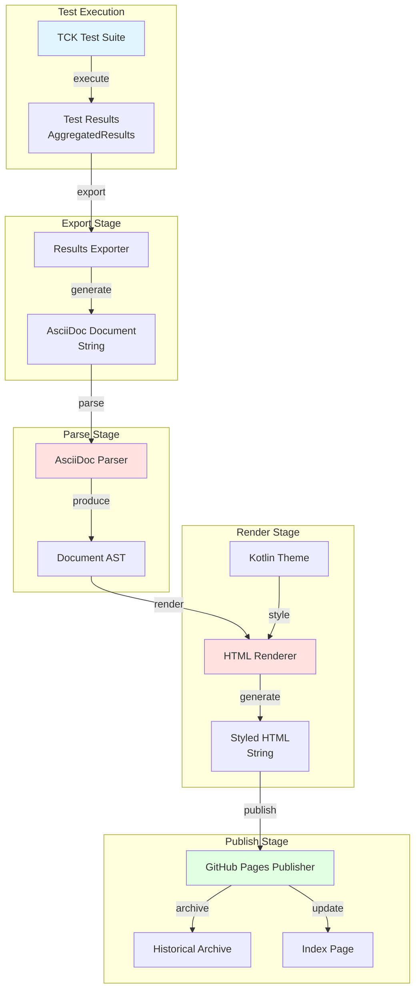
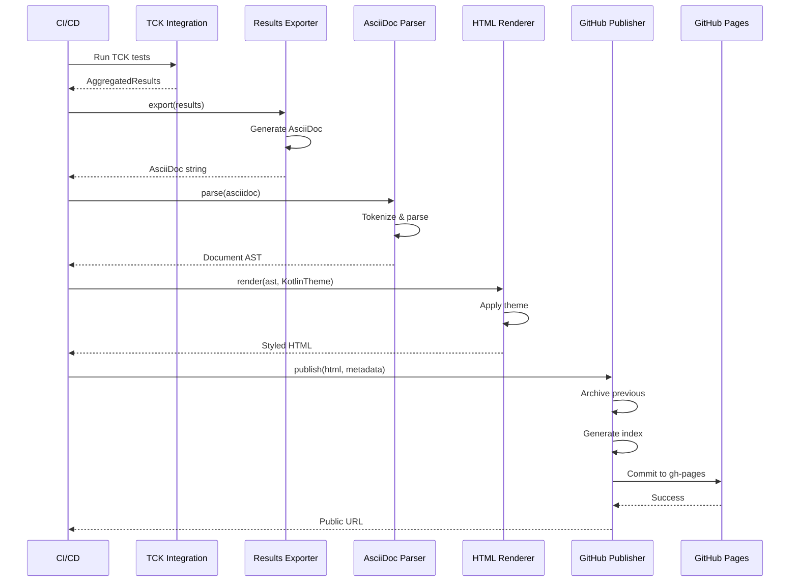

# Design Document: TCK Results Publisher

## Overview

The TCK Results Publisher is a dogfooding feature that uses AsciiDoc Konvert's own parsing and rendering pipeline to publish official TCK test results to GitHub Pages. This provides transparent visibility into certification progress while validating that our implementation works correctly on real-world content.

The system follows a pipeline architecture: TCK Test Execution → Results Export (to AsciiDoc) → Parse (using our parser) → Render (using our HTML renderer with Kotlin theme) → Publish (to GitHub Pages). Each stage validates the previous stage's output, creating a self-validating system.

### Key Design Principles

1. **Dogfooding First**: Use our own parser and renderer exclusively - no external AsciiDoc tools
2. **Transparency**: Publish all results publicly, including failures
3. **Automation**: Integrate with CI/CD for automatic updates
4. **Historical Tracking**: Preserve previous results to show progress over time
5. **Visual Appeal**: Use Kotlin theme for professional, on-brand presentation

## Architecture

### High-Level Architecture



### Component Interaction



## Components and Interfaces

### 1. Results Exporter

**Purpose**: Convert TCK test results into AsciiDoc format

**Interface**:
```kotlin
interface TckResultsExporter {
    /**
     * Export test results to AsciiDoc format
     * 
     * @param results Aggregated test results from TCK execution
     * @param metadata Additional metadata (timestamp, versions, etc.)
     * @return AsciiDoc document as a string
     */
    fun export(
        results: AggregatedResults,
        metadata: ExportMetadata
    ): Result<String>
}

data class ExportMetadata(
    val timestamp: Long,
    val specVersion: String,
    val tckCommitHash: String,
    val libraryVersion: String,
    val platforms: List<String>,
    val runId: String  // Unique identifier for this test run
)
```

**Implementation**: `DefaultTckResultsExporter`

**Responsibilities**:
- Generate AsciiDoc document structure (title, sections, tables)
- Format test results as AsciiDoc lists and tables
- Include summary statistics with visual indicators
- Add metadata section with version information
- Use AsciiDoc admonitions for pass/fail status
- Generate category breakdowns
- Include failed test details with error messages

**AsciiDoc Output Format**:
```asciidoc
= AsciiDoc Konvert - TCK Certification Results
:toc: left
:toclevels: 3
:icons: font

== Summary

[cols="1,3"]
|===
| Metric | Value

| Total Tests | 13
| Passed | 10 (76.9%)
| Failed | 2 (15.4%)
| Errors | 1 (7.7%)
| Certification Status | In Progress
|===

TIP: Overall pass rate: *76.9%*

== Test Results by Category

=== Inline Tests

[cols="2,1,1"]
|===
| Test Name | Status | Duration

| inline/no-markup/single-word | ✅ PASSED | 15ms
| inline/emphasis/simple | ❌ FAILED | 23ms
|===

=== Block Tests

...

== Failed Tests

WARNING: The following tests failed:

=== inline/emphasis/simple

*Error*: Expected emphasis node, got text node

*Expected Output*:
[source,json]
----
{"name": "emphasis", ...}
----

*Actual Output*:
[source,json]
----
{"name": "text", ...}
----

== Metadata

* Generated: 2026-01-24 10:30:00 UTC
* Spec Version: 1.0.0
* TCK Commit: abc123def456
* Library Version: 1.0.0
* Platforms: JVM, iOS, Linux
```

### 2. AsciiDoc Parser Integration

**Purpose**: Parse the exported AsciiDoc document using our own parser

**Interface**: Uses existing `DefaultAsciidocParser`

```kotlin
// Existing interface - no changes needed
interface AsciidocParser {
    fun parse(input: String): ParseResult
}
```

**Integration Point**:
```kotlin
class TckResultsPublisher(
    private val exporter: TckResultsExporter,
    private val parser: AsciidocParser,  // DefaultAsciidocParser
    private val renderer: HtmlRenderer,
    private val publisher: GitHubPagesPublisher
) {
    fun publishResults(results: AggregatedResults): Result<PublishResult> {
        // 1. Export to AsciiDoc
        val asciidoc = exporter.export(results, metadata).getOrElse { return Result.failure(it) }
        
        // 2. Parse using our parser (dogfooding!)
        val parseResult = parser.parse(asciidoc)
        if (!parseResult.success) {
            return Result.failure(Exception("Parser failed on our own output: ${parseResult.errors}"))
        }
        
        // 3. Render to HTML
        // ... continue pipeline
    }
}
```

**Validation**: If parsing fails, it indicates a bug in either the exporter or parser

### 3. HTML Renderer Integration

**Purpose**: Render the parsed AST to HTML with Kotlin theme

**Interface**: Uses existing `HtmlRenderer` with `KotlinTheme`

```kotlin
// Existing interfaces - no changes needed
interface HtmlRenderer {
    fun render(document: Document, config: RenderConfig): Result<String>
}

data class RenderConfig(
    val outputOptions: OutputOptions = OutputOptions.default(),
    val theme: Theme = Theme.default(),
    val cssOptions: CssOptions = CssOptions.default()
)
```

**Configuration**:
```kotlin
val renderConfig = RenderConfig(
    outputOptions = OutputOptions(
        standalone = true,           // Complete HTML document
        cssMode = CssMode.INLINE,    // Inline CSS for GitHub Pages
        includeMetadata = true,
        includeToc = true,           // Table of contents for navigation
        documentTitle = "AsciiDoc Konvert - TCK Results"
    ),
    theme = KotlinTheme(),           // Dark background, red accents
    cssOptions = CssOptions(
        cssVariableOverrides = mapOf(
            // Customize for test results
            "--mp-color-success" to "#10b981",  // Green for passed tests
            "--mp-color-error" to "#ef4444",    // Red for failed tests
            "--mp-color-warning" to "#f59e0b"   // Orange for errors
        ),
        customCssContent = """
            /* Custom styles for test results */
            .test-passed { color: var(--mp-color-success); }
            .test-failed { color: var(--mp-color-error); }
            .test-error { color: var(--mp-color-warning); }
            .pass-rate-high { color: var(--mp-color-success); font-weight: bold; }
            .pass-rate-medium { color: var(--mp-color-warning); font-weight: bold; }
            .pass-rate-low { color: var(--mp-color-error); font-weight: bold; }
        """.trimIndent()
    )
)
```

### 4. GitHub Pages Publisher

**Purpose**: Publish HTML to GitHub Pages with historical tracking

**Interface**:
```kotlin
interface GitHubPagesPublisher {
    /**
     * Publish HTML to GitHub Pages
     * 
     * @param html Rendered HTML content
     * @param metadata Metadata for this publication
     * @return Result with public URL
     */
    suspend fun publish(
        html: String,
        metadata: PublishMetadata
    ): Result<PublishResult>
    
    /**
     * Generate index page linking to all historical results
     * 
     * @param publications List of all published results
     * @return Result with index HTML
     */
    fun generateIndex(
        publications: List<PublicationRecord>
    ): Result<String>
}

data class PublishMetadata(
    val runId: String,
    val timestamp: Long,
    val specVersion: String,
    val passRate: Double,
    val totalTests: Int,
    val passedTests: Int
)

data class PublishResult(
    val publicUrl: String,
    val commitHash: String,
    val archivedPath: String
)

data class PublicationRecord(
    val runId: String,
    val timestamp: Long,
    val publicUrl: String,
    val passRate: Double,
    val totalTests: Int,
    val passedTests: Int,
    val specVersion: String
)
```

**Implementation**: `DefaultGitHubPagesPublisher`

**Responsibilities**:
- Clone/pull gh-pages branch
- Archive previous results with timestamp
- Write new HTML to `latest.html`
- Write timestamped copy to `results/{runId}.html`
- Generate/update index page
- Commit and push changes
- Return public URL

**Directory Structure**:
```
gh-pages/
├── index.html              # Index page with links to all results
├── latest.html             # Most recent results (symlink or copy)
├── results/
│   ├── 2026-01-24-103000.html
│   ├── 2026-01-23-153000.html
│   └── 2026-01-22-093000.html
└── assets/
    └── (any additional assets if needed)
```

**Index Page Format**:
```html
<!DOCTYPE html>
<html>
<head>
    <title>AsciiDoc Konvert - TCK Results History</title>
    <style>/* Kotlin theme styles */</style>
</head>
<body>
    <h1>AsciiDoc Konvert - TCK Certification Results</h1>
    
    <h2>Latest Results</h2>
    <p><a href="latest.html">View Latest Results</a></p>
    <p>Pass Rate: <strong>76.9%</strong> (10/13 tests)</p>
    <p>Generated: 2026-01-24 10:30:00 UTC</p>
    
    <h2>Historical Results</h2>
    <table>
        <thead>
            <tr>
                <th>Date</th>
                <th>Pass Rate</th>
                <th>Tests</th>
                <th>Spec Version</th>
                <th>Link</th>
            </tr>
        </thead>
        <tbody>
            <tr>
                <td>2026-01-24 10:30</td>
                <td class="pass-rate-medium">76.9%</td>
                <td>10/13</td>
                <td>1.0.0</td>
                <td><a href="results/2026-01-24-103000.html">View</a></td>
            </tr>
            <tr>
                <td>2026-01-23 15:30</td>
                <td class="pass-rate-medium">69.2%</td>
                <td>9/13</td>
                <td>1.0.0</td>
                <td><a href="results/2026-01-23-153000.html">View</a></td>
            </tr>
        </tbody>
    </table>
    
    <h2>Progress Chart</h2>
    <!-- Simple ASCII chart or link to external charting -->
    <pre>
    100% |                                    
     80% |                    ●               
     60% |              ●                     
     40% |        ●                           
     20% |  ●                                 
      0% |____________________________________
         Jan 22  Jan 23  Jan 24  Jan 25
    </pre>
</body>
</html>
```

### 5. Workflow Orchestrator

**Purpose**: Coordinate the complete pipeline

**Interface**:
```kotlin
interface TckResultsPublishWorkflow {
    /**
     * Execute the complete publish workflow
     * 
     * @param results TCK test results to publish
     * @return Result with publication details
     */
    suspend fun execute(
        results: AggregatedResults
    ): Result<WorkflowResult>
}

data class WorkflowResult(
    val asciidocGenerated: Boolean,
    val parseSucceeded: Boolean,
    val renderSucceeded: Boolean,
    val publishSucceeded: Boolean,
    val publicUrl: String?,
    val errors: List<String>,
    val durationMs: Long
)
```

**Implementation**: `DefaultTckResultsPublishWorkflow`

```kotlin
class DefaultTckResultsPublishWorkflow(
    private val exporter: TckResultsExporter,
    private val parser: AsciidocParser,
    private val renderer: HtmlRenderer,
    private val publisher: GitHubPagesPublisher,
    private val config: PublishConfig
) : TckResultsPublishWorkflow {
    
    override suspend fun execute(results: AggregatedResults): Result<WorkflowResult> {
        val startTime = currentTimeMillis()
        val errors = mutableListOf<String>()
        
        // Stage 1: Export to AsciiDoc
        val asciidoc = exporter.export(results, createMetadata()).getOrElse {
            errors.add("Export failed: ${it.message}")
            return Result.failure(it)
        }
        
        // Stage 2: Parse AsciiDoc (dogfooding!)
        val parseResult = parser.parse(asciidoc)
        if (!parseResult.success) {
            errors.add("Parse failed: ${parseResult.errors}")
            return Result.failure(Exception("Parser failed on our own output"))
        }
        
        // Stage 3: Render to HTML
        val html = renderer.render(parseResult.document, createRenderConfig()).getOrElse {
            errors.add("Render failed: ${it.message}")
            return Result.failure(it)
        }
        
        // Stage 4: Publish to GitHub Pages
        val publishResult = publisher.publish(html, createPublishMetadata(results)).getOrElse {
            errors.add("Publish failed: ${it.message}")
            return Result.failure(it)
        }
        
        val duration = currentTimeMillis() - startTime
        
        return Result.success(WorkflowResult(
            asciidocGenerated = true,
            parseSucceeded = true,
            renderSucceeded = true,
            publishSucceeded = true,
            publicUrl = publishResult.publicUrl,
            errors = errors,
            durationMs = duration
        ))
    }
}
```

## Data Models

### Export Metadata

```kotlin
data class ExportMetadata(
    val timestamp: Long,
    val specVersion: String,
    val tckCommitHash: String,
    val libraryVersion: String,
    val platforms: List<String>,
    val runId: String
)
```

### Publish Configuration

```kotlin
data class PublishConfig(
    val githubToken: String?,           // GitHub token for authentication
    val repositoryUrl: String,          // e.g., "github.com/user/repo.git"
    val branch: String = "gh-pages",    // Target branch
    val baseUrl: String,                // e.g., "https://user.github.io/repo"
    val authorName: String = "TCK Bot",
    val authorEmail: String = "tck-bot@example.com",
    val commitMessage: String = "Update TCK results"
)
```

### Publication Record

```kotlin
data class PublicationRecord(
    val runId: String,
    val timestamp: Long,
    val publicUrl: String,
    val passRate: Double,
    val totalTests: Int,
    val passedTests: Int,
    val specVersion: String,
    val tckCommitHash: String,
    val libraryVersion: String,
    val platforms: List<String>
)
```

### Workflow Result

```kotlin
data class WorkflowResult(
    val asciidocGenerated: Boolean,
    val parseSucceeded: Boolean,
    val renderSucceeded: Boolean,
    val publishSucceeded: Boolean,
    val publicUrl: String?,
    val errors: List<String>,
    val durationMs: Long
)
```


## Error Handling

### Error Categories

1. **Export Errors**: Failures during AsciiDoc generation
2. **Parse Errors**: Failures when parsing our own output (critical bugs!)
3. **Render Errors**: Failures during HTML generation
4. **Publish Errors**: Failures during GitHub Pages publication
5. **Network Errors**: Git operations, GitHub API failures

### Error Handling Strategy

```kotlin
sealed class PublishError {
    data class ExportError(val message: String, val cause: Throwable?) : PublishError()
    data class ParseError(val message: String, val errors: List<ParseError>) : PublishError()
    data class RenderError(val message: String, val cause: Throwable?) : PublishError()
    data class PublishError(val message: String, val cause: Throwable?) : PublishError()
    data class NetworkError(val message: String, val cause: Throwable?) : PublishError()
}
```

### Error Recovery

**Export Errors**:
- Log the error with full context
- Save the problematic results data for debugging
- Fail the workflow (cannot proceed without AsciiDoc)

**Parse Errors** (CRITICAL):
- Treat as a critical bug in either exporter or parser
- Save the generated AsciiDoc for debugging
- Create a GitHub issue automatically
- Fail the workflow
- Alert developers immediately

**Render Errors**:
- Log the error with AST context
- Save the AST for debugging
- Fail the workflow (cannot proceed without HTML)

**Publish Errors**:
- Retry up to 3 times with exponential backoff
- Save HTML locally as fallback
- Log error but don't fail the workflow
- Notify developers via CI/CD notifications

**Network Errors**:
- Retry with exponential backoff (1s, 2s, 4s)
- Check network connectivity
- Provide clear error messages
- Save work locally for manual recovery

### Validation Points

1. **Post-Export Validation**: Verify AsciiDoc is non-empty and contains expected sections
2. **Post-Parse Validation**: Verify AST contains expected structure (document, sections, tables)
3. **Post-Render Validation**: Verify HTML is valid HTML5 and contains expected content
4. **Post-Publish Validation**: Verify published URL is accessible

```kotlin
interface ResultValidator {
    fun validateAsciidoc(asciidoc: String): ValidationResult
    fun validateAst(ast: Document): ValidationResult
    fun validateHtml(html: String): ValidationResult
    fun validatePublication(url: String): ValidationResult
}

sealed class ValidationResult {
    object Valid : ValidationResult()
    data class Invalid(val errors: List<String>) : ValidationResult()
}
```

## Testing Strategy

### Unit Testing

**Components to Test**:

1. **TckResultsExporter**
   - Test AsciiDoc generation for various result sets
   - Test formatting of pass/fail indicators
   - Test table generation
   - Test metadata inclusion
   - Test edge cases (0 tests, all passed, all failed)

2. **GitHubPagesPublisher**
   - Test directory structure creation
   - Test archiving logic
   - Test index page generation
   - Test commit message formatting
   - Mock Git operations for testing

3. **TckResultsPublishWorkflow**
   - Test complete pipeline with mocked components
   - Test error handling at each stage
   - Test rollback on failures
   - Test logging and progress reporting

**Example Unit Tests**:

```kotlin
class TckResultsExporterTest {
    @Test
    fun `should generate valid AsciiDoc for passing tests`() {
        val results = createMockResults(passed = 10, failed = 0)
        val exporter = DefaultTckResultsExporter()
        
        val asciidoc = exporter.export(results, mockMetadata()).getOrThrow()
        
        assertTrue(asciidoc.contains("= AsciiDoc Konvert"))
        assertTrue(asciidoc.contains("Total Tests | 10"))
        assertTrue(asciidoc.contains("✅ PASSED"))
    }
    
    @Test
    fun `should include failed test details`() {
        val results = createMockResults(
            passed = 8,
            failed = 2,
            failedTests = listOf(
                TestExecutionResult(
                    fixtureId = "test1",
                    status = TestStatus.FAILED,
                    errorMessage = "Expected emphasis, got text"
                )
            )
        )
        val exporter = DefaultTckResultsExporter()
        
        val asciidoc = exporter.export(results, mockMetadata()).getOrThrow()
        
        assertTrue(asciidoc.contains("== Failed Tests"))
        assertTrue(asciidoc.contains("test1"))
        assertTrue(asciidoc.contains("Expected emphasis, got text"))
    }
}
```

### Integration Testing

**End-to-End Tests**:

1. **Complete Pipeline Test**
   - Run actual TCK tests (small subset)
   - Export to AsciiDoc
   - Parse with real parser
   - Render with real renderer
   - Verify HTML output (don't actually publish)

2. **Dogfooding Validation Test**
   - Generate AsciiDoc with various content
   - Parse and verify no errors
   - Render and verify output quality
   - Ensure no external tools are used

3. **Historical Tracking Test**
   - Simulate multiple publications
   - Verify archiving works correctly
   - Verify index page updates correctly
   - Verify links are valid

**Example Integration Test**:

```kotlin
class TckResultsPublishWorkflowTest {
    @Test
    fun `should complete full pipeline successfully`() = runTest {
        // Arrange
        val results = TckIntegration.runTests(context)
        val workflow = createWorkflow(mockPublisher = true)
        
        // Act
        val result = workflow.execute(results).getOrThrow()
        
        // Assert
        assertTrue(result.asciidocGenerated)
        assertTrue(result.parseSucceeded)
        assertTrue(result.renderSucceeded)
        assertTrue(result.publishSucceeded)
        assertTrue(result.errors.isEmpty())
    }
    
    @Test
    fun `should fail gracefully when parser fails`() = runTest {
        // This should NEVER happen in production, but test the error path
        val workflow = createWorkflow(
            exporter = BrokenExporter() // Generates invalid AsciiDoc
        )
        
        val result = workflow.execute(mockResults())
        
        assertTrue(result.isFailure)
        // Should log critical error about parser failing on our own output
    }
}
```

### Property-Based Testing

Property-based tests will be defined after the Correctness Properties section is completed.

### Manual Testing

**Pre-Release Checklist**:

1. Run full TCK suite and publish results
2. Verify published page is accessible
3. Check visual styling (Kotlin theme applied correctly)
4. Verify all links work (historical results, index)
5. Test on mobile devices (responsive design)
6. Verify metadata is accurate
7. Check that failed tests show error details
8. Verify progress chart updates correctly

## CI/CD Integration

### GitHub Actions Workflow

```yaml
name: Publish TCK Results

on:
  push:
    branches: [main]
  schedule:
    - cron: '0 0 * * *'  # Daily at midnight
  workflow_dispatch:      # Manual trigger

jobs:
  publish-tck-results:
    runs-on: ubuntu-latest
    
    steps:
      - name: Checkout code
        uses: actions/checkout@v3
      
      - name: Setup JDK
        uses: actions/setup-java@v3
        with:
          java-version: '11'
          distribution: 'temurin'
      
      - name: Run TCK Tests
        run: ./gradlew :tck-quality-testing:jvmTest --tests "OfficialTckTest"
      
      - name: Publish Results
        env:
          GITHUB_TOKEN: ${{ secrets.GITHUB_TOKEN }}
        run: ./gradlew :tck-quality-testing:publishTckResults
      
      - name: Comment on PR (if applicable)
        if: github.event_name == 'pull_request'
        uses: actions/github-script@v6
        with:
          script: |
            github.rest.issues.createComment({
              issue_number: context.issue.number,
              owner: context.repo.owner,
              repo: context.repo.repo,
              body: '📊 TCK Results published: [View Results](${{ env.RESULTS_URL }})'
            })
```

### Gradle Task

```kotlin
// In tck-quality-testing/build.gradle.kts

tasks.register("publishTckResults") {
    group = "publishing"
    description = "Run TCK tests and publish results to GitHub Pages"
    
    dependsOn("jvmTest")
    
    doLast {
        // Execute the publish workflow
        val results = TckIntegration.runTests(context)
        val workflow = TckResultsPublishWorkflow.create()
        val result = runBlocking { workflow.execute(results) }
        
        if (result.isSuccess) {
            println("✅ Results published: ${result.getOrThrow().publicUrl}")
        } else {
            throw GradleException("Failed to publish results: ${result.exceptionOrNull()?.message}")
        }
    }
}
```

### Local Development

```bash
# Run TCK tests and publish results locally (dry-run)
./gradlew :tck-quality-testing:publishTckResults --dry-run

# Run TCK tests and publish results (requires GitHub token)
export GITHUB_TOKEN=your_token_here
./gradlew :tck-quality-testing:publishTckResults

# View generated HTML locally before publishing
./gradlew :tck-quality-testing:generateTckResultsHtml
open tck-quality-testing/build/tck-results/latest.html
```

## Platform Considerations

### Kotlin Multiplatform Support

The TCK Results Publisher will initially target **JVM only** for the following reasons:

1. **Git Operations**: Git operations are easiest on JVM with JGit library
2. **File I/O**: GitHub Pages publishing requires extensive file operations
3. **CI/CD Integration**: Most CI/CD systems run on JVM-compatible environments
4. **Network Operations**: GitHub API calls are simpler on JVM

**Future Expansion**: The core components (exporter, parser, renderer) are platform-agnostic and can be used on other platforms. Only the publisher component is JVM-specific.

### Platform-Specific Implementations

```kotlin
// Common
expect class GitOperations {
    suspend fun clone(url: String, path: String): Result<Unit>
    suspend fun pull(path: String): Result<Unit>
    suspend fun commit(path: String, message: String): Result<Unit>
    suspend fun push(path: String): Result<Unit>
}

// JVM
actual class GitOperations {
    actual suspend fun clone(url: String, path: String): Result<Unit> {
        // Use JGit library
        return withContext(Dispatchers.IO) {
            try {
                Git.cloneRepository()
                    .setURI(url)
                    .setDirectory(File(path))
                    .call()
                Result.success(Unit)
            } catch (e: Exception) {
                Result.failure(e)
            }
        }
    }
    // ... other implementations
}
```

### Dependencies

**JVM-Specific Dependencies**:
- `org.eclipse.jgit:org.eclipse.jgit:6.8.0` - Git operations
- `com.squareup.okhttp3:okhttp:4.12.0` - HTTP client for GitHub API (optional)

**Common Dependencies** (already available):
- `org.markup.poet:asciidoc-parser` - Our parser
- `org.markup.poet:html-renderer` - Our renderer
- `org.markup.poet:tck-quality-testing` - TCK integration

## Security Considerations

### GitHub Token Management

**Best Practices**:
1. Use GitHub Actions secrets for CI/CD
2. Never commit tokens to repository
3. Use environment variables for local development
4. Rotate tokens regularly
5. Use fine-grained personal access tokens with minimal permissions

**Required Permissions**:
- `contents: write` - Push to gh-pages branch
- `pages: write` - Trigger GitHub Pages build

### Input Validation

**Validate All Inputs**:
1. Test results data (ensure no malicious content)
2. Metadata (sanitize strings)
3. File paths (prevent directory traversal)
4. URLs (validate format)

**Sanitization**:
```kotlin
fun sanitizeForAsciidoc(text: String): String {
    return text
        .replace("<", "\\<")
        .replace(">", "\\>")
        .replace("|", "\\|")
        .take(10000) // Limit length
}

fun sanitizeFilename(name: String): String {
    return name
        .replace(Regex("[^a-zA-Z0-9-_.]"), "-")
        .take(255)
}
```

### Content Security

**HTML Output**:
- All HTML is generated by our renderer (no user-provided HTML)
- CSS is inline (no external resources)
- No JavaScript (static HTML only)
- No external images or resources

**GitHub Pages**:
- Served over HTTPS
- No server-side code execution
- Static content only


## Correctness Properties

A property is a characteristic or behavior that should hold true across all valid executions of a system—essentially, a formal statement about what the system should do. Properties serve as the bridge between human-readable specifications and machine-verifiable correctness guarantees.

### Property 1: Complete Test Information Export

*For any* set of TCK test results, the exported AsciiDoc document SHALL contain all test information including test name, status (pass/fail/error/pending/skipped), category, error messages for failures, and appropriate visual indicators for each status.

**Validates: Requirements 1.1, 1.2, 1.3, 1.4**

**Rationale**: This property ensures that no test information is lost during export. Every test result must be fully represented in the AsciiDoc output.

### Property 2: Organizational Structure Preservation

*For any* set of TCK test results containing multiple categories, the exported AsciiDoc document SHALL organize tests by category with each category as a separate section.

**Validates: Requirements 1.5**

**Rationale**: This ensures the exported document has a logical structure that makes it easy to navigate and understand results by category.

### Property 3: Complete Summary and Metadata

*For any* set of TCK test results, the exported AsciiDoc document SHALL include summary statistics (total tests, passed, failed, pass rate, certification status) and complete metadata (timestamp, spec version, TCK commit hash, library version, platforms).

**Validates: Requirements 1.6, 1.7, 4.1, 4.2, 4.3, 4.7**

**Rationale**: This ensures the report is self-contained with all necessary context for understanding the results.

### Property 4: Dogfooding Round-Trip (CRITICAL)

*For any* valid set of TCK test results, exporting to AsciiDoc then parsing with our AsciiDoc parser SHALL succeed without errors.

**Validates: Requirements 2.1, 8.4**

**Rationale**: This is the core dogfooding property. If our parser cannot parse our own output, it indicates a critical bug in either the exporter or parser. This property validates that we're truly using our own tools.

### Property 5: Information Preservation Through Parse

*For any* set of TCK test results, after exporting to AsciiDoc and parsing to AST, the AST SHALL contain all essential test result information (test names, statuses, categories, error messages).

**Validates: Requirements 2.3**

**Rationale**: This ensures that parsing preserves the semantic content of the results. The AST should contain all the information needed to reconstruct the test results.

### Property 6: Successful HTML Rendering

*For any* valid Document AST generated from TCK results, rendering to HTML with the Kotlin theme SHALL succeed and produce a standalone HTML document with inline CSS.

**Validates: Requirements 3.1, 3.2, 3.5**

**Rationale**: This ensures the rendering pipeline works for all valid inputs and produces the expected output format.

### Property 7: Visual Status Differentiation

*For any* HTML document rendered from TCK results, tests with different statuses (pass/fail/error/pending/skipped) SHALL have different CSS classes or visual indicators in the HTML output.

**Validates: Requirements 3.4**

**Rationale**: This ensures that the visual presentation distinguishes between different test outcomes, making the report easy to understand at a glance.

### Property 8: Failed Test Details Inclusion

*For any* set of TCK test results containing failed tests, the generated report SHALL include a section listing all failed tests with their error messages and expected vs actual output.

**Validates: Requirements 4.4**

**Rationale**: This ensures that developers have all the information needed to debug failing tests.

### Property 9: Recommendations Generation

*For any* set of TCK test results where certification is not ready, the generated report SHALL include at least one recommendation for achieving certification.

**Validates: Requirements 4.5**

**Rationale**: This ensures the report is actionable, providing guidance on what needs to be fixed.

### Property 10: Historical Preservation

*For any* sequence of publications, each new publication SHALL preserve all previous results in the archive directory with unique timestamps, and no previous results SHALL be deleted or overwritten.

**Validates: Requirements 5.3, 7.1**

**Rationale**: This ensures we maintain a complete history of test results, allowing us to track progress over time.

### Property 11: Index Completeness

*For any* set of archived publications, the generated index page SHALL contain links to all archived results sorted by timestamp in descending order (newest first).

**Validates: Requirements 5.4, 7.2**

**Rationale**: This ensures the index provides complete navigation to all historical results.

### Property 12: Change Detection

*For any* two consecutive test runs, if a test changes status (pass→fail or fail→pass), the newer report SHALL mark the test as either "newly passing" or "regression" accordingly.

**Validates: Requirements 7.3, 7.4, 7.5**

**Rationale**: This ensures that changes in test status are highlighted, making it easy to see progress or identify regressions.

### Property 13: Pipeline Stage Logging

*For any* execution of the publishing workflow, the system SHALL log progress messages for each stage (export, parse, render, publish) before executing that stage.

**Validates: Requirements 6.3**

**Rationale**: This ensures visibility into the workflow execution, making it easier to debug issues and understand progress.

### Property 14: Error Propagation

*For any* execution of the publishing workflow, if any stage fails (export, parse, render, or publish), the workflow SHALL stop immediately and return a failure result with error details.

**Validates: Requirements 6.4**

**Rationale**: This ensures that errors are caught early and don't cascade through the pipeline, and that failures are reported clearly.

### Property 15: Execution Time Reporting

*For any* execution of the publishing workflow, the result SHALL include the total execution time in milliseconds.

**Validates: Requirements 6.5**

**Rationale**: This provides performance visibility and helps identify slow stages in the pipeline.

### Property 16: HTML Structure Validation

*For any* HTML document generated from TCK results, the HTML SHALL be valid HTML5 and SHALL contain the expected structural elements (document title, summary section, category sections, failed tests section, metadata section).

**Validates: Requirements 8.5**

**Rationale**: This ensures the generated HTML is well-formed and contains all expected sections, validating the complete pipeline.

### Property 17: Public URL Generation

*For any* successful publication to GitHub Pages, the result SHALL include a valid public URL in the format `https://{user}.github.io/{repo}/tck-results/latest.html`.

**Validates: Requirements 5.6**

**Rationale**: This ensures that published results are accessible and the URL is correctly formatted.

### Property 18: Asset Inclusion

*For any* publication to GitHub Pages, the commit SHALL include all necessary files (HTML document, any CSS files if external mode, index page).

**Validates: Requirements 5.2**

**Rationale**: This ensures that all required files are published together, so the page renders correctly.

## Testing Strategy

### Dual Testing Approach

This feature requires both unit tests and property-based tests:

- **Unit tests**: Verify specific examples, edge cases, and error conditions
- **Property tests**: Verify universal properties across all inputs

Both are complementary and necessary for comprehensive coverage.

### Unit Testing Focus

Unit tests should focus on:

1. **Specific Examples**
   - Export a known set of test results and verify the AsciiDoc format
   - Parse a known AsciiDoc document and verify the AST structure
   - Render a known AST and verify the HTML output
   - Test the complete pipeline with a small, known dataset

2. **Edge Cases**
   - Empty test results (0 tests)
   - All tests passing (100% pass rate)
   - All tests failing (0% pass rate)
   - Very long error messages (truncation)
   - Special characters in test names or error messages
   - Malformed AsciiDoc (for error handling tests)

3. **Error Conditions**
   - Export failure (invalid results data)
   - Parse failure (malformed AsciiDoc) - should be treated as critical
   - Render failure (invalid AST)
   - Publish failure (network error, Git error)
   - Each stage failure should be tested independently

4. **Integration Points**
   - Mock Git operations for publisher tests
   - Mock file I/O for local testing
   - Test CI/CD integration with dry-run mode

### Property-Based Testing Focus

Property tests should focus on:

1. **Export Properties**
   - Property 1: Complete test information export
   - Property 2: Organizational structure preservation
   - Property 3: Complete summary and metadata

2. **Dogfooding Properties** (CRITICAL)
   - Property 4: Dogfooding round-trip
   - Property 5: Information preservation through parse
   - Property 6: Successful HTML rendering

3. **Rendering Properties**
   - Property 7: Visual status differentiation
   - Property 16: HTML structure validation

4. **Publishing Properties**
   - Property 10: Historical preservation
   - Property 11: Index completeness
   - Property 18: Asset inclusion

5. **Workflow Properties**
   - Property 13: Pipeline stage logging
   - Property 14: Error propagation
   - Property 15: Execution time reporting

### Property-Based Test Configuration

- **Minimum iterations**: 100 per property test
- **Test library**: Kotest Property Testing (for Kotlin Multiplatform)
- **Tag format**: `Feature: tck-results-publisher, Property {number}: {property_text}`

### Test Data Generators

For property-based testing, we need generators for:

```kotlin
// Generator for test results
fun Arb.Companion.testExecutionResult(): Arb<TestExecutionResult> = arbitrary {
    TestExecutionResult(
        fixtureId = Arb.string(1..100).bind(),
        status = Arb.enum<TestStatus>().bind(),
        platform = Arb.of("JVM", "iOS", "Linux").bind(),
        durationMs = Arb.long(0..5000).bind(),
        category = Arb.enum<TestCategory>().bind(),
        source = Arb.of("official", "custom", null).bind(),
        errorMessage = if (Arb.boolean().bind()) Arb.string(1..500).bind() else null,
        actualOutput = if (Arb.boolean().bind()) Arb.string(1..1000).bind() else null,
        expectedOutput = if (Arb.boolean().bind()) Arb.string(1..1000).bind() else null
    )
}

// Generator for aggregated results
fun Arb.Companion.aggregatedResults(): Arb<AggregatedResults> = arbitrary {
    val results = Arb.list(Arb.testExecutionResult(), 1..50).bind()
    // Aggregate the results
    DefaultResultAggregator().aggregate(results)
}

// Generator for export metadata
fun Arb.Companion.exportMetadata(): Arb<ExportMetadata> = arbitrary {
    ExportMetadata(
        timestamp = Arb.long(1000000000000..2000000000000).bind(),
        specVersion = Arb.of("1.0.0", "1.1.0", "2.0.0").bind(),
        tckCommitHash = Arb.string(40..40).bind(), // Git SHA
        libraryVersion = Arb.of("1.0.0", "1.1.0", "2.0.0").bind(),
        platforms = Arb.list(Arb.of("JVM", "iOS", "Linux"), 1..3).bind(),
        runId = Arb.uuid().bind().toString()
    )
}
```

### Example Property Test

```kotlin
class TckResultsExporterPropertyTest {
    
    @Test
    fun `Property 1 - Complete test information export`() = runTest {
        checkAll(
            iterations = 100,
            Arb.aggregatedResults(),
            Arb.exportMetadata()
        ) { results, metadata ->
            // Feature: tck-results-publisher, Property 1: Complete test information export
            
            val exporter = DefaultTckResultsExporter()
            val asciidoc = exporter.export(results, metadata).getOrThrow()
            
            // Verify all tests are present
            results.allTests.forEach { test ->
                asciidoc shouldContain test.fixtureId
                asciidoc shouldContain test.status.toString()
                asciidoc shouldContain test.category.toString()
                
                if (test.errorMessage != null) {
                    asciidoc shouldContain test.errorMessage
                }
            }
            
            // Verify status indicators
            if (results.passed > 0) {
                asciidoc shouldContain "✅"
            }
            if (results.failed > 0) {
                asciidoc shouldContain "❌"
            }
        }
    }
    
    @Test
    fun `Property 4 - Dogfooding round-trip (CRITICAL)`() = runTest {
        checkAll(
            iterations = 100,
            Arb.aggregatedResults(),
            Arb.exportMetadata()
        ) { results, metadata ->
            // Feature: tck-results-publisher, Property 4: Dogfooding round-trip
            
            val exporter = DefaultTckResultsExporter()
            val parser = DefaultAsciidocParser()
            
            // Export to AsciiDoc
            val asciidoc = exporter.export(results, metadata).getOrThrow()
            
            // Parse with our parser (dogfooding!)
            val parseResult = parser.parse(asciidoc)
            
            // CRITICAL: Parsing must succeed
            parseResult.success shouldBe true
            parseResult.errors.shouldBeEmpty()
            
            // If this fails, it's a critical bug in either exporter or parser
        }
    }
}
```

### Manual Testing Checklist

Before release, manually verify:

1. ✅ Run full TCK suite and publish results
2. ✅ Verify published page is accessible at public URL
3. ✅ Check visual styling (Kotlin theme applied correctly)
4. ✅ Verify all links work (historical results, index)
5. ✅ Test on mobile devices (responsive design)
6. ✅ Verify metadata is accurate (versions, timestamps)
7. ✅ Check that failed tests show error details
8. ✅ Verify progress tracking works (compare multiple runs)
9. ✅ Test local development workflow (dry-run mode)
10. ✅ Verify CI/CD integration works

### Performance Targets

- **Export**: < 100ms for 100 tests
- **Parse**: < 500ms for typical results document
- **Render**: < 200ms for typical document
- **Publish**: < 5s for Git operations
- **Total workflow**: < 10s for typical run

### Backward Compatibility

This is a new feature, so no backward compatibility concerns. However:

- The AsciiDoc format should be versioned for future changes
- The publication format should be stable to avoid breaking historical links
- The API should be designed for future extensibility

