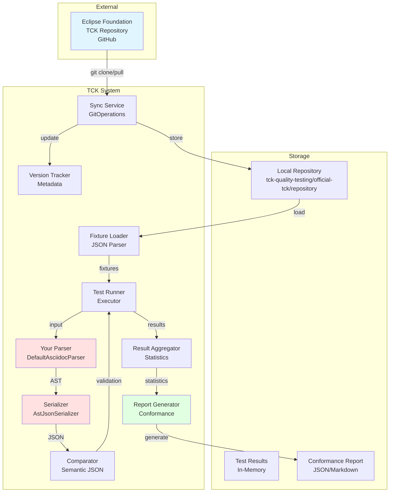
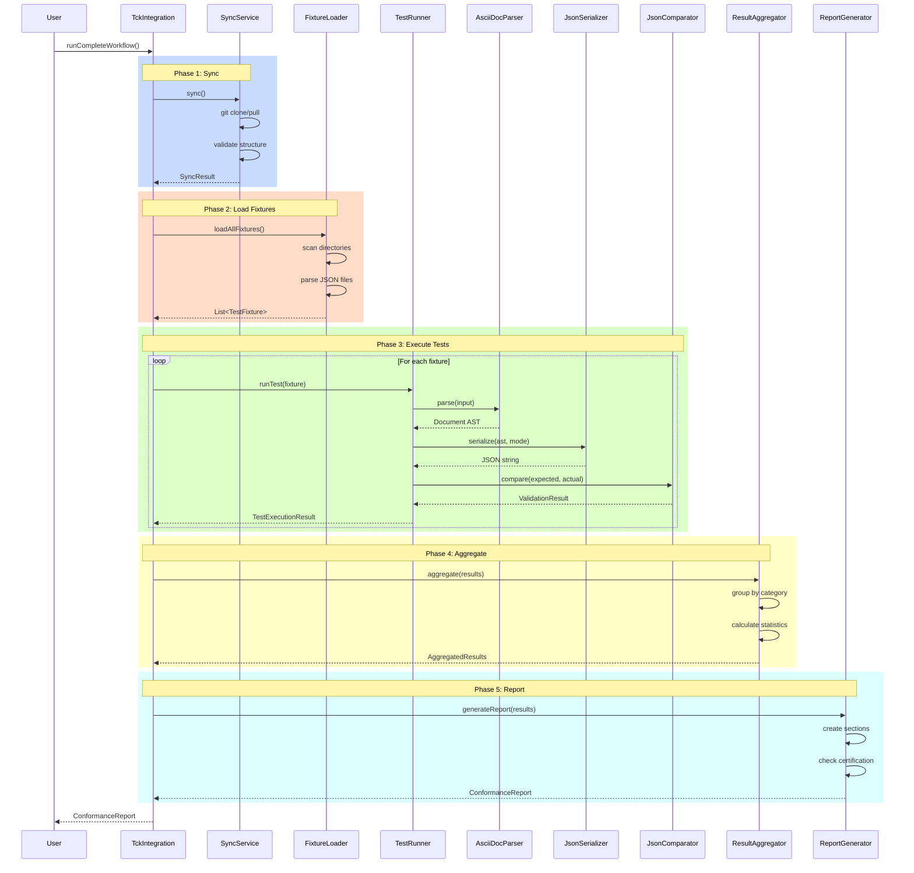
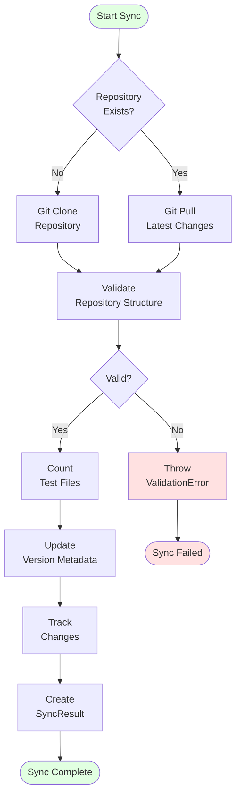
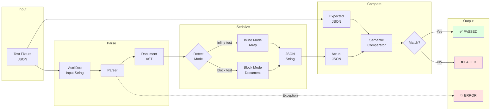
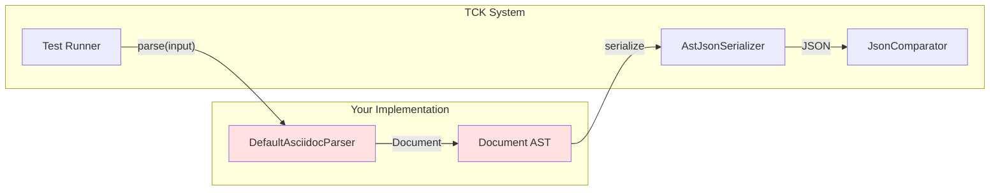
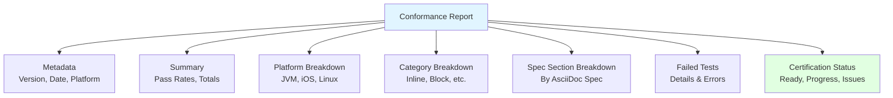

# Official AsciiDoc TCK - Architecture & Data Flow

**Version:** 1.0  
**Date:** January 24, 2026  
**Status:** Production

## Table of Contents

1. [Overview](#overview)
2. [System Architecture](#system-architecture)
3. [Data Flow](#data-flow)
4. [TCK Sync Process](#tck-sync-process)
5. [Test Execution Flow](#test-execution-flow)
6. [Data Formats](#data-formats)
7. [Storage & Results](#storage--results)
8. [Integration Points](#integration-points)

---

## Overview

The Official AsciiDoc TCK (Technology Compatibility Kit) is a comprehensive test suite from the Eclipse Foundation that validates AsciiDoc parser implementations for spec compliance. This document describes the complete architecture, data flow, and integration process.

### Key Components

- **TCK Repository:** Official test fixtures from Eclipse Foundation
- **Sync Service:** Manages repository synchronization
- **Test Runner:** Executes tests against your parser
- **Result Aggregator:** Collects and analyzes results
- **Report Generator:** Creates conformance reports

---

## System Architecture



---

## Data Flow

### Complete Test Execution Flow



---

## TCK Sync Process

### Sync Workflow



### Sync Data Structure

```kotlin
data class SyncResult(
    val success: Boolean,
    val metadata: SyncMetadata,
    val changeReport: ChangeReport?
)

data class SyncMetadata(
    val specVersion: String,      // e.g., "1.0.0"
    val commitHash: String,        // Git commit SHA
    val syncTimestamp: Long,       // Unix timestamp
    val testCount: Int,            // Number of tests
    val durationMs: Long           // Sync duration
)

data class ChangeReport(
    val addedTests: List<String>,
    val modifiedTests: List<String>,
    val removedTests: List<String>
)
```

---

## Test Execution Flow

### Single Test Execution



### Test Result Structure

```kotlin
data class TestExecutionResult(
    val fixtureId: String,           // e.g., "inline/no-markup/single-word"
    val status: TestStatus,          // PASSED, FAILED, ERROR, PENDING, SKIPPED
    val platform: String,            // "JVM", "iOS", "Linux"
    val durationMs: Long,            // Execution time
    val category: TestCategory,      // INLINE, BLOCK, etc.
    val source: String?,             // "official" or "custom"
    val errorMessage: String?,       // Error description
    val actualOutput: String?,       // Generated JSON
    val expectedOutput: String?,     // Expected JSON
    val diff: String?,               // Difference details
    val stackTrace: String?          // Exception stack trace
)

enum class TestStatus {
    PASSED,    // Test passed
    FAILED,    // Test failed (wrong output)
    ERROR,     // Test threw exception
    PENDING,   // Test not yet implemented
    SKIPPED    // Test was skipped
}
```

---

## Data Formats

### Test Fixture Format (Input)

Test fixtures are stored as JSON files in the TCK repository:

```json
{
  "id": "inline/no-markup/single-word",
  "category": "inline",
  "description": "Single word with no markup",
  "input": "word",
  "expectedOutput": [
    {
      "name": "text",
      "type": "string",
      "value": "word",
      "location": [
        {"line": 1, "col": 1},
        {"line": 1, "col": 5}
      ]
    }
  ],
  "metadata": {
    "source": "official",
    "type": "inline",
    "specSection": "3.1.2"
  }
}
```

### AST JSON Format (Output)

#### Inline Test Output (Array)

```json
[
  {
    "name": "text",
    "type": "string",
    "value": "word",
    "location": [
      {"line": 1, "col": 1},
      {"line": 1, "col": 5}
    ]
  }
]
```

#### Block Test Output (Document)

```json
{
  "name": "document",
  "type": "block",
  "blocks": [
    {
      "name": "paragraph",
      "type": "block",
      "inlines": [
        {
          "name": "text",
          "type": "string",
          "value": "Hello world",
          "location": [
            {"line": 1, "col": 1},
            {"line": 1, "col": 12}
          ]
        }
      ],
      "location": [
        {"line": 1, "col": 1},
        {"line": 1, "col": 12}
      ]
    }
  ],
  "location": [
    {"line": 1, "col": 1},
    {"line": 1, "col": 12}
  ]
}
```

### Location Format

All AST nodes include location information:

```json
"location": [
  {"line": 1, "col": 1},    // Start position (inclusive)
  {"line": 1, "col": 5}     // End position (exclusive)
]
```

**Key Points:**
- **1-based indexing:** Lines and columns start at 1
- **Exclusive end:** End position points AFTER the last character
- **Array format:** Always an array with exactly 2 elements
- **Required:** All nodes must have location information

---

## Storage & Results

### Directory Structure

```
tck-quality-testing/
├── official-tck/
│   ├── repository/              # Synced from Eclipse Foundation
│   │   ├── inline/
│   │   │   ├── no-markup/
│   │   │   │   ├── single-word.json
│   │   │   │   └── multiple-words.json
│   │   │   ├── emphasis/
│   │   │   └── strong/
│   │   ├── block/
│   │   │   ├── paragraph/
│   │   │   ├── heading/
│   │   │   └── list/
│   │   └── README.md
│   └── version.json             # Version metadata
├── fixtures/                    # Custom test fixtures
│   ├── blocks/
│   ├── inline/
│   └── conformance/
└── build/
    └── reports/
        └── tests/
            └── jvmTest/
                └── index.html   # Test results HTML
```

### Version Metadata

```json
{
  "specVersion": "1.0.0",
  "commitHash": "abc123def456",
  "lastSyncTimestamp": 1706140800000,
  "testCount": 13,
  "repositoryUrl": "https://github.com/eclipse-asciidoc/asciidoc-tck.git"
}
```

### Aggregated Results Structure

```kotlin
data class AggregatedResults(
    val totalTests: Int,
    val passed: Int,
    val failed: Int,
    val errors: Int,
    val pending: Int,
    val skipped: Int,
    val byPlatform: Map<String, CategoryResults>,
    val byCategory: Map<TestCategory, CategoryResults>,
    val bySource: Map<String, CategoryResults>,
    val failedTests: List<TestExecutionResult>,
    val slowTests: List<TestExecutionResult>
)

data class CategoryResults(
    val total: Int,
    val passed: Int,
    val failed: Int,
    val errors: Int,
    val passRate: Double
)
```

---

## Integration Points

### Your Parser Integration



### Integration Code

```kotlin
// In TckIntegration.kt
private fun createDefaultTestRunner(): TestRunner {
    val parser = DefaultAsciidocParser()  // Your parser
    val serializer = AstJsonSerializer()   // Your serializer
    
    return object : TestRunner {
        override fun runTest(fixture: TestFixture): TestExecutionResult {
            // 1. Parse input
            val parseResult = parser.parse(fixture.input)
            
            // 2. Detect mode (inline vs block)
            val mode = if (fixture.id.contains("/inline/")) {
                AstJsonSerializer.Mode.INLINE_ONLY
            } else {
                AstJsonSerializer.Mode.FULL_DOCUMENT
            }
            
            // 3. Serialize to JSON
            val actualJson = serializer.serialize(parseResult.document, mode)
            
            // 4. Compare with expected
            val result = JsonComparator.compare(
                expected = fixture.expectedOutput,
                actual = actualJson
            )
            
            // 5. Return result
            return TestExecutionResult(...)
        }
    }
}
```

### Serializer Modes

```kotlin
enum class Mode {
    INLINE_ONLY,      // For inline tests: output array of inline elements
    FULL_DOCUMENT     // For block tests: output full document structure
}
```

**Mode Detection:**
- Check fixture ID: if contains `/inline/` → INLINE_ONLY
- Check metadata: if `type == "inline"` → INLINE_ONLY
- Default: FULL_DOCUMENT

---

## Conformance Report

### Report Structure



### Report JSON Format

```json
{
  "metadata": {
    "generatedAt": 1706140800000,
    "specVersion": "1.0.0",
    "tckCommitHash": "abc123",
    "libraryVersion": "1.0.0",
    "platforms": ["JVM", "iOS", "Linux"]
  },
  "summary": {
    "totalTests": 13,
    "passed": 10,
    "failed": 2,
    "errors": 1,
    "overallPassRate": 0.769,
    "officialTestsPassRate": 0.769,
    "customTestsPassRate": 1.0
  },
  "certificationStatus": {
    "isReady": false,
    "overallProgress": 76.9,
    "blockingIssues": [
      {
        "severity": "HIGH",
        "description": "Emphasis markup not implemented"
      }
    ],
    "recommendations": [
      "Implement emphasis (_text_) parsing",
      "Fix location tracking for nested elements"
    ]
  }
}
```

---

## Configuration

### TCK Configuration File

```json
{
  "sync": {
    "repositoryUrl": "https://github.com/eclipse-asciidoc/asciidoc-tck.git",
    "localPath": "tck-quality-testing/official-tck/repository",
    "autoSync": false,
    "branch": "main"
  },
  "execution": {
    "enableOfficialTests": true,
    "enableCustomTests": true,
    "parallelExecution": false,
    "timeoutMs": 5000
  },
  "reporting": {
    "outputFormat": "json",
    "includeStackTraces": true,
    "verboseLogging": true
  }
}
```

---

## Summary

### Key Takeaways

1. **TCK Repository:** Official tests from Eclipse Foundation, synced via Git
2. **Test Format:** JSON fixtures with input and expected JSON AST output
3. **Execution:** Parse → Serialize → Compare → Aggregate → Report
4. **Output Format:** Two modes (inline array vs full document)
5. **Location Tracking:** 1-based, exclusive end, required for all nodes
6. **Results:** Stored in-memory, aggregated by platform/category/source
7. **Conformance:** Generated report with certification status

### Data Flow Summary

```
Eclipse TCK Repo → Git Sync → Local Storage → Fixture Loader → 
Test Runner → Your Parser → AST → Serializer → JSON → 
Comparator → Results → Aggregator → Report Generator → 
Conformance Report
```

---

## References

- **Official TCK Format:** `tck-quality-testing/docs/official-tck-format.md`
- **Column Tracking:** `tck-quality-testing/COLUMN_TRACKING_COMPLETE.md`
- **Progress Logging:** `tck-quality-testing/PROGRESS_LOGGING_ADDED.md`
- **Certification Status:** `CERTIFICATION_STATUS.md`
